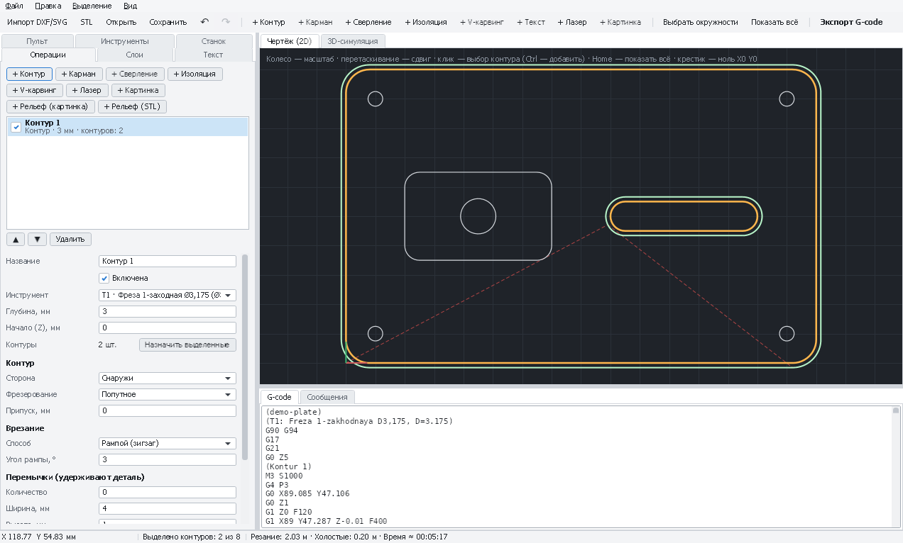
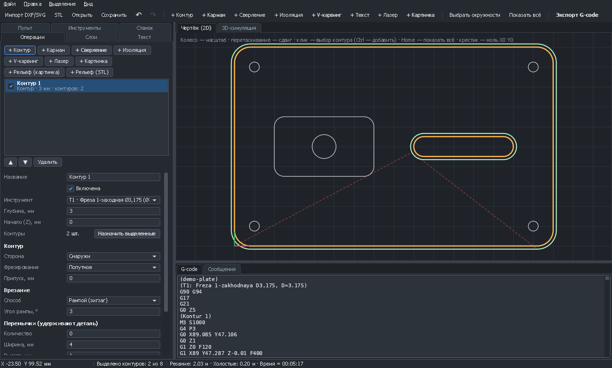
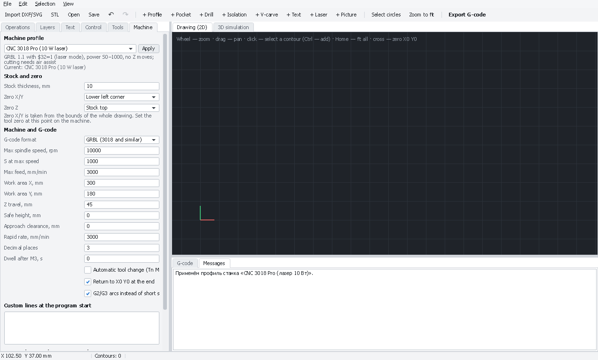
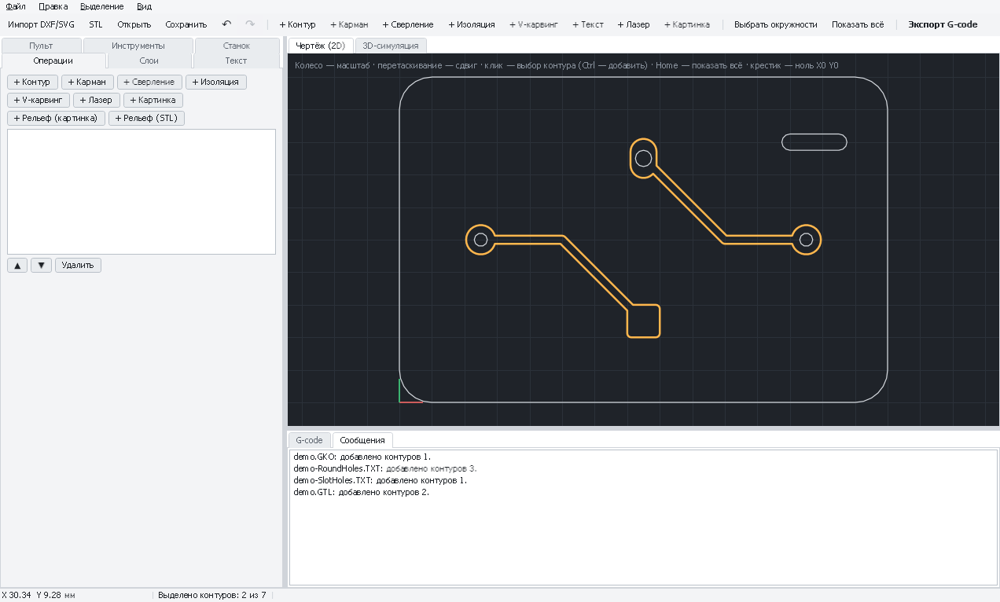
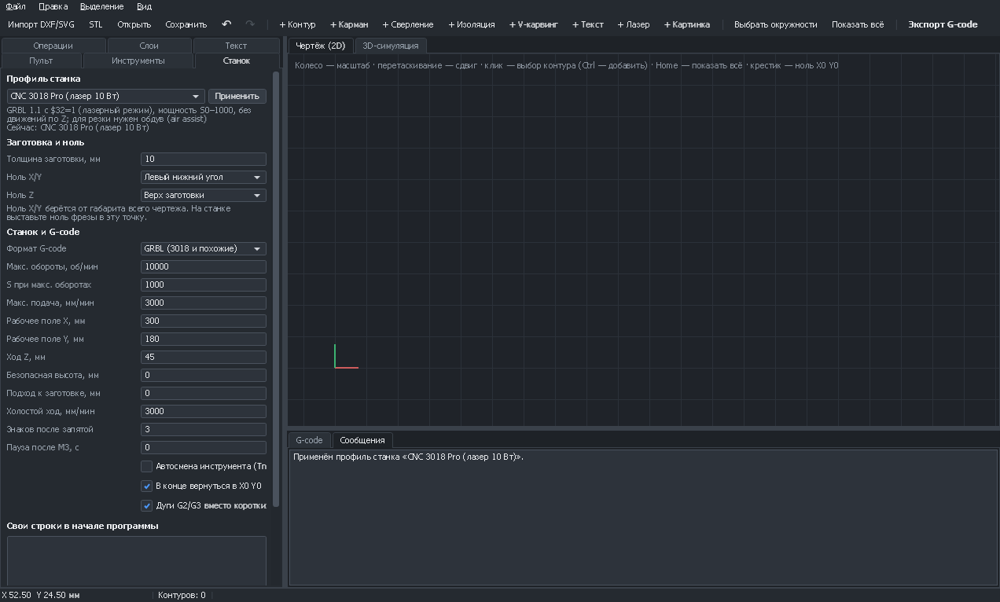
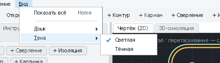

#  PathForge

Простая CAM-программа для фрезерных станков с ЧПУ и лазерных модулей на **WPF / .NET 8** (Visual Studio 2022):
загружаете чертёж (DXF, SVG), файлы печатной платы (Gerber, Excellon) или 3D-модель (STL), выбираете контуры,
задаёте операции — получаете G-code и запускаете его прямо из программы.

> Новый станок? Начните с инструкции **[Проверка и первый запуск CNC 3018 Pro (шпиндель 775)](docs/first-run-3018.md)**,
> а если на станке только лазер — **[первый запуск CNC 3018 Pro с лазерным модулем](docs/first-run-3018-laser.md)**.
>
> Что означает каждая команда G-code, `$`-команда и ответ платы — **[справочник по командам GRBL 1.1](docs/grbl-commands.md)**.
>
> Как пользоваться каждой операцией (контур, карман, сверление, торцовка, V-карвинг, рельеф 3D, лазер, картинка,
> текст, раскладка, симуляция) — **[подробные инструкции по операциям](docs/operations/README.md)**.
>
> Плата MKS DLC32 (WiFi, Grbl_Esp32)? Смотрите **[подключение и настройку MKS DLC32](docs/mks-dlc32.md)**.
> Плата MKS Robin Nano (Marlin или grblHAL)? Смотрите **[подключение и настройку MKS Robin Nano](docs/mks-robin-nano.md)**.
>
> Печатная плата? Подробные инструкции для новичков: **[фрезеровкой (изоляция гравёром)](docs/pcb-milling.md)** и
> **[лазером (краска + травление)](docs/pcb-laser.md)**.

Ещё скриншоты: тёмная тема, английский интерфейс

## Что умеет

| Функция | Описание |
|---|---|
| Печатные платы | Файлы для производства из **KiCad, Altium Designer**, Eagle, EasyEDA. Gerber RS-274X/X2 (медь — как площади, контур платы — как линии; апертуры C/R/O/P и макросы, дуги в обоих режимах G74/G75, полигоны, отрицательная полярность; дюймы и мм). Сверловка Excellon / NC Drill (`*.drl`, `*.txt` из Altium с `;FILE_FORMAT=`), пазы `G85` и фрезерованные (`M15`…`M16`) — как контуры для фрезерования. По атрибутам X2 подсказывает, если файл загружен не той кнопкой, и напоминает зеркалить нижний слой. Панели с повтором блоков (`%SR`). **Все файлы платы сразу**: медь, контур и сверловка распознаются сами (атрибуты X2 или имена файлов), маска, шелкография и паста пропускаются. Зеркалирование для нижнего слоя, выбор отверстий одного диаметра. Паз шириной с фрезу «Контуром внутри» проходится по оси. **Базовые отверстия** для двусторонних плат: два симметричных отверстия под штифты вне контура — вторая сторона совпадает без перестановки нуля |
| Изоляция дорожек | Обход меди гравёром в несколько проходов с перекрытием; предупреждение, если дорожки ближе ширины реза |
| Плата лазером | Медь покрыта краской, лазер выжигает её вокруг дорожек, затем плата травится. **Полоса** заданной ширины вокруг меди или **вся лишняя медь** внутри контура платы (с полями); пятно лазера учитывается — край выжженной полосы ложится на край меди; штриховка, крест-накрест на чётных проходах, обводка вдоль меди; расширение/сужение меди под подтрав; предупреждения, если зазор меньше пятна или шаг линий больше пятна. Контур платы узнаётся по имени слоя, отверстия дают вытравленные метки для сверления |
| Гравёр (V-образный) | Ширина реза считается по глубине, диаметру кончика и углу |
| Дуги G2/G3 | Участки траектории на окружности выводятся дугами: файл короче, движение плавнее (проверка радиуса как в GRBL) |
| Лазер | Профили «3018 + лазер 5 Вт» и «3018 + лазер 10 Вт» (GRBL `$32=1`, `M4`, мощность S0–1000, без движений по Z). Резка и обводка по контурам в несколько проходов с опусканием фокуса; заливка штриховкой (угол, шаг, с учётом отверстий); гравировка картинок PNG/JPG/BMP: оттенки серого, дизеринг или порог, шаг строк, перебег, в обе стороны; оттенки мощностью или **скоростью** (для диодных лазеров с нелинейной мощностью). **Компенсация ширины реза**: детали или отверстия в размер. **Микроперемычки**: на наружных контурах луч гаснет на долю миллиметра — деталь держится в листе и не переворачивается под соплом. **Обдув** по операциям (`M8` или `M7`, выключение `M9`): включается сам на резку, выключается на гравировку. **Тест-сетка** мощность × скорость с выжженными подписями — подобрать режим под материал; **тест фокуса** — ряд линий на разной высоте Z с подписями. **Гибкий шарнир** (living hinge): прорези в шахматном порядке для гнутых панелей из фанеры |
| Импорт SVG | path (все команды, кривые Безье, дуги), rect со скруглениями, circle, ellipse, line, polyline, polygon, use; трансформации групп; единицы и viewBox; слои Inkscape; скрытые элементы пропускаются |
| Слои | Вкладка «Слои»: видимость, число контуров, «Выделить» / «+» по слою; скрытые слои не выделяются. Чертежи можно добавлять к текущему (DXF, SVG, Gerber, сверловка) |
| 3D-рельеф | Импорт STL (двоичный и текстовый) и рельеф из картинки (яркость → глубина). Построчная обработка с расчётом «падающей фрезы» для сферической, концевой фрезы и гравёра (без зарезов), черновые проходы по уровням с припуском; чистовая строками вдоль X или Y, по уровням Z (waterline — ровные проходы по крутым стенкам) или обоими способами; уровни **только на крутых участках** (угол задаётся); обработка **только внутри выбранных контуров**. **Дообработка остатков** меньшей фрезой: операции перед ней симулируются, и фреза проходит только там, где над моделью остался материал (кнопка «+ Дообработка остатков» на вкладке «3D-симуляция») |
| Импорт DXF | LINE, ARC, CIRCLE, LWPOLYLINE (с дугами), POLYLINE, ELLIPSE, SPLINE, блоки (INSERT с масштабом, поворотом и массивом), единицы `$INSUNITS` (мм, дюймы, см, м). Перетаскивание файла в окно |
| Сборка контуров | Отдельные отрезки и дуги автоматически склеиваются в контуры (допуск 0,01 мм, в пределах одного слоя) |
| Контур | Снаружи / внутри с коррекцией на радиус фрезы или по линии; попутное и встречное фрезерование; припуск; несколько проходов по глубине; перемычки. **Дообработка по симуляции**: операции выше симулируются, и контур режется только там, где фреза ещё встретит материал (глубже прошлого реза, припуск чернового прохода) |
| Карман | Выборка кольцами от центра к стенке; вложенные контуры становятся островами; припуск. **Адаптивный карман**: трохоидальный канал по середине, затем кольца от него с малым шагом — фреза всё время снимает одинаково узкую полосу, без полного погружения по ширине в углах (шаг на изгибах уменьшается автоматически). **Дообработка**: после крупной фрезы маленькая проходит только по оставшимся углам и узким местам — по диаметру крупной фрезы или **по симуляции** операций выше (углы, припуск, недобранная глубина) |
| Торцовка | Выравнивание жертвенного стола или верха заготовки зигзагом: область — выделенные контуры с полями, заданный прямоугольник или всё поле станка; выход фрезы за край, проходы по глубине |
| Сверление | В центрах окружностей, с шагом (выводом стружки) или за один проход. **Пазы** (G85 и фрезерованные из сверловки) — рядом отверстий вдоль оси, сначала через одно |
| Порядок обработки | Сначала внутренние контуры, потом наружные (деталь не освобождается раньше времени); ближайший следующий |
| Инструменты | Библиотека в проекте: диаметр, обороты, подача, врезание, шаг по глубине, перекрытие |
| G-code | G0/G1, G90/G21, M3/M5, обдув M8 (M7) / M9, свои строки в начале и конце. Формат **GRBL** (строки ≤ 70 символов, комментарии латиницей, смена фрезы паузой `M0`) или **общий** (LinuxCNC, Mach3, `Tn M6`) |
| Профили станков | CNC 3018 Pro со шпинделем 775 (10 000 об/мин), со шпинделем 500 Вт (12 000 об/мин), с лазером 5 Вт и 10 Вт; общий (LinuxCNC, Mach3). Обороты переводятся в диапазон `S0…S1000` (GRBL `$30`) |
| Проверки | Программа больше рабочего поля (300×180×45 мм для 3018), подача выше максимальной, обороты выше максимума шпинделя, глубина больше толщины заготовки |
| Ноль заготовки | X0 Y0 в углу или центре чертежа (или как в чертеже), Z0 на верху заготовки или на столе |
| Врезание | Вертикально, рампой (зигзагом вдоль начала траектории) или по спирали: контур проходится непрерывно опускающимися витками без единого вертикального врезания, у кармана спиральный заход начинается заранее и стоит только длину рампы. Угол задаётся; на перемычках используется зигзаг |
| Подвод по дуге | Для контура снаружи/внутри: заход и выход по касательной четверти окружности со стороны отхода — без следа в месте врезания. Начало берётся в середине прямого участка; если дуга не помещается (маленькое отверстие), радиус уменьшается |
| Текст | Любой установленный шрифт OpenType: TrueType (.ttf, .ttc) и CFF (.otf, включая CID-шрифты), **вариативные шрифты** (TrueType с gvar и CFF2: насыщенность, ширина и другие оси, готовые начертания); **текст по дуге** (по верху или по низу окружности — как на круглой печати); кернинг пар из GPOS и таблицы kern; несколько строк, высота заглавных букв, выравнивание, межбуквенный и межстрочный интервал, зеркально. Буквы — обычные контуры: к ним применимы все операции (контур, карман, лазер, V-карвинг). При изменении текста операции сами получают новые буквы |
| V-карвинг | Резьба V-фрезой: глубина в каждой точке зависит от ширины буквы, края остаются острыми, углы прорезаются до вершины. Ограничение глубины даёт плоское дно, проходы по шагу инструмента |
| Пресеты инструментов | Типичные фрезы и сверла для 3018: дерево, МДФ, акрил, алюминий, рельеф (сферические), текстолит (кукуруза, гравёры 20° и 30°, сверла для плат), V-фрезы 60° и 90°; лазерные модули 5 и 10 Вт |
| Управление станком | Вкладка «Пульт»: подключение к GRBL по USB (COM-порт) или по сети (telnet и WebSocket — MKS DLC32 и другие платы Grbl_Esp32, мосты ESP8266, FluidNC), автоматическое восстановление связи при обрыве, перемещение с клавиатуры и джойстика (включается вручную), положение X/Y/Z, перемещение кнопками с выбором шага, ноль по осям, поиск Z щупом (G38.2), разблокировка, дом, сброс. Запуск программы проекта или готового файла с заполнением буфера GRBL (character counting), **обводка рамки** перед работой (лазер на минимальной мощности проходит по границе задания — видно, где будет резка), пауза, продолжение, стоп без потери положения, коррекция подачи и оборотов на ходу, прогресс и время, **подсветка выполняемой строки G-code** (и в 3D-симуляции), консоль с расшифровкой ошибок и аварий. На смене фрезы (M0) программа ждёт: можно двигать станок и заново найти Z. Положение шпинделя показывается на чертеже. Карта высот для плат: щуп обходит сетку точек, программа при запуске повторяет неровности текстолита (автовыравнивание). **Проверка программы ($C)**: GRBL разбирает каждую строку со своими настройками, станок не двигается. **Продолжение с нужной строки** после сломанной фрезы, пропадания питания или остановки: режимы строк до неё восстанавливаются, подъезд безопасный (вверх, над точкой, шпиндель, вниз с подачей врезания), номер строки после остановки подставляется сам |
| 3D-симуляция | Вкладка «3D-симуляция»: снятие материала на карте высот с формой фрезы (концевая, сферическая, V-образная, сверло), следы лазера; воспроизведение ×1…×1000, перемотка ползунком в любой момент, вращение и масштаб камеры. Показывает снятый объём и предупреждает о холостых ходах сквозь материал и о выходе фрезы ниже заготовки. **Сравнение с моделью** рельефа: недорезы и зарезы цветом и цифрами; **траектория текущей операции** поверх заготовки; **карта высот** платы с увеличением по высоте |
| Раскладка | Детали (замкнутый контур со всем, что внутри) раскладываются по листу плотно, по реальной форме, с зазором, поворотами (шаг 90° или любой: 45°, 15°, 5°…) и копиями; операции получают все копии. **Детали в отверстиях** других деталей (рамки, кольца) |
| Просмотр | 2D-вид: масштаб колесом, сдвиг перетаскиванием, выбор контуров кликом (Ctrl — добавить), **«Выделить всё»** (кнопка, Ctrl+A, правая кнопка мыши на чертеже), Esc — снять выделение; траектории и холостые ходы |
| Проект | Сохранение всего (контуры, инструменты, операции, настройки станка, карта высот) в JSON-файл `*.pfproj`. Отмена и повтор действий (Ctrl+Z / Ctrl+Y) |
| Оценка | Длина реза и холостых ходов, примерное время обработки |
| Язык и тема | Интерфейс на русском или английском, светлая или тёмная тема — переключаются в меню **Вид** на ходу и запоминаются (`%AppData%\PathForge\settings.json`). При первом запуске язык берётся из Windows. Размер и положение окна, развёрнутость, ширина панелей и открытые вкладки тоже запоминаются |

## Как пользоваться

1. **Файл → Импорт чертежа** (DXF или SVG, можно перетащить файл в окно). Для пробы есть [`samples/demo-plate.dxf`](samples/demo-plate.dxf), [`samples/demo-sign.svg`](samples/demo-sign.svg) и 3D-модель [`samples/dome.stl`](samples/dome.stl).
2. Выделите контуры кликом (Ctrl — несколько; все — кнопка «Выделить всё», Ctrl+A или правая кнопка мыши на чертеже;
   «Выбрать окружности» — все отверстия; Esc — снять выделение).
3. Нажмите **+ Контур**, **+ Карман** или **+ Сверление**: операция получит выделенные контуры.
   Позже их можно заменить кнопкой «Назначить выделенные».
4. Настройте инструмент, глубину и параметры. Траектории и G-code пересчитываются сразу.
5. **Экспорт G-code** (Ctrl+E).

Глубины задаются положительными числами от верха заготовки. Ноль X/Y и Z выбирается на вкладке «Станок»;
крестик на чертеже показывает, где будет X0 Y0.

## Печатная плата за 5 шагов

Коротко — для тех, кто уже делал платы. Подробно, с подготовкой заготовки, режимами и разбором ошибок:
**[плата фрезеровкой](docs/pcb-milling.md)** и **[плата лазером и травлением](docs/pcb-laser.md)**.

1. **Файл → Печатная плата →** «Добавить Gerber: медь» (KiCad: `*-F_Cu.gbr` / `*-B_Cu.gbr`; Altium: `*.GTL` / `*.GBL`),
   «Добавить сверловку» (KiCad: `*.drl`; Altium: `*.TXT`), «Добавить Gerber: контур платы»
   (KiCad: `*-Edge_Cuts.gbr`; Altium: `*.GKO` или `*.GM1`).
   Для пробы есть [`samples/pcb-demo`](samples/pcb-demo) (KiCad) и [`samples/pcb-altium`](samples/pcb-altium) (Altium).
2. Если фрезеруете **нижний** слой — «Зеркалить по X». Ноль заготовки — левый нижний угол (вкладка «Станок»).
3. «Инструменты» → пресеты «Текстолит (платы)»: гравёр 20°, сверло, кукуруза Ø1,0.
4. Операции:
   - выделите медь → **+ Изоляция** (гравёр, глубина 0,08–0,1 мм, 2–3 прохода);
   - выделите отверстие → «Выделение → Выделить отверстия того же диаметра» → **+ Сверление**;
   - выделите контур платы → **+ Контур** снаружи кукурузой, глубина = толщина платы + 0,2 мм, перемычки.
5. Перед изоляцией снимите **карту высот** («Пульт» → «Карта высот», см. [ниже](#плата-с-картой-высот-автовыравнивание)):
   текстолит никогда не лежит идеально ровно, а глубина изоляции — сотые доли миллиметра. Запустите программу
   с «Пульта» (или экспортируйте G-code для Candle — тогда карту высот снимайте в нём).

## Плата лазером (краска + травление)

Медь заготовки красится чёрной матовой краской, лазер выжигает краску там, где медь должна исчезнуть,
плата промывается и травится. Дорожки тоньше, чем гравёром, и не нужна карта высот. Полная инструкция —
**[docs/pcb-laser.md](docs/pcb-laser.md)**.

1. «Станок» → профиль **«CNC 3018 Pro (лазер 5 Вт)»** или **«(лазер 10 Вт)»** → «Применить». «Инструменты» →
   пресет лазера; **диаметр = размер пятна** (измерьте после фокусировки).
2. Режим подберите **тест-сеткой** на покрашенном обрезке (вкладка «Операции» → «Тест лазера», «Рез (контур)» выключен).
3. Добавьте файлы платы. Верхний слой **не зеркалится** (краска прямо на меди), нижний — «Зеркалить по X».
4. Выделите медь и контур платы (Ctrl+A) → **+ Плата лазером**: контур узнаётся по имени слоя (`Edge_Cuts`, `.GKO`,
   `.GM1`), остальное — медь. **Полоса вокруг меди** 0,6–1 мм (быстро) или **вся лишняя медь** (чище);
   2 прохода, шаг линий 0,05–0,08 мм (меньше пятна), крест-накрест.
5. Ноль X0 Y0 в углу платы, ▶ Старт. Затем промывка (вода, средство, щётка), травление, снятие краски.

## Платы из Altium Designer

PathForge читает те же файлы, что и завод: **Gerber** и **NC Drill**. ODB++ и IPC-2581 не поддерживаются.

1. **File → Fabrication Outputs → Gerber Files**:
   - *General*: единицы **Millimeters** (формат 4:4) или **Inches** (формат 2:5) — подходят оба;
   - *Layers*: **Top Layer** и/или **Bottom Layer**, плюс слой с контуром платы — **Keep-Out** или **Mechanical 1**
     (смотря где нарисован контур);
   - *Apertures*: **Embedded apertures (RS274X)**;
   - *Advanced*: запомните, от какого нуля выводятся координаты (обычно *Reference to relative origin*).
2. **File → Fabrication Outputs → NC Drill Files**: те же единицы и формат, **Suppress leading zeroes**
   (или trailing — оба варианта читаются), координаты — **от того же нуля**, что и у Gerber, иначе отверстия
   сдвинутся относительно меди. Пазы можно выводить и как *drilled slot (G85)*, и как *routed path*.
3. В папке проекта (обычно `Project Outputs`) появятся файлы:

   | Файл | Что это | Кнопка в PathForge |
   |---|---|---|
   | `*.GTL` / `*.GBL` | Медь сверху / снизу | «Добавить Gerber: медь» |
   | `*.GKO` или `*.GM1` | Контур платы (Keep-Out / Mechanical 1) | «Добавить Gerber: контур платы» |
   | `*.TXT` (`-RoundHoles`, `-SlotHoles`, `-Plated`, `-NonPlated`) | Сверловка и пазы | «Добавить сверловку» |
   | `*.DRR`, `*.GTO`, `*.GTS`, `*.GTP`… | Отчёт, шелкография, маска, паста | не нужны |

4. Дальше — как в разделе «Печатная плата за 5 шагов». Нижний слой (`*.GBL`) Altium выводит «вид сверху»:
   перед фрезерованием его нужно отзеркалить (PathForge напомнит об этом, если в файле есть атрибуты X2).
5. **Пазы** (овальные отверстия) появляются на слое «Пазы Ø…» как замкнутые контуры: выделите их →
   **+ Контур**, сторона **«Внутри»**, кукурузой или концевой фрезой меньше ширины паза (фреза шириной с паз
   пройдёт по его оси). Или **+ Сверление**: паз сверлится рядом отверстий вдоль оси.

## Лазерный модуль

1. Вкладка «Станок» → профиль **«CNC 3018 Pro (лазер 5 Вт)»** или **«CNC 3018 Pro (лазер 10 Вт)»** → «Применить». В GRBL должно быть `$32=1`
   (лазерный режим: на холостых ходах луч гаснет сам) и `$30=1000`.
2. «Инструменты» → пресет «Лазер: Лазерный модуль 5 Вт» или «Лазер: Лазерный модуль 10 Вт» (пятно меньше — ≈0,1 мм).
3. **Резка / обводка / заливка**: выделите контуры → **+ Лазер**, выберите режим, мощность, скорость, проходы.
   Для толстой фанеры включите «Опускать Z за проход». Мелкие детали держите **микроперемычками** (2–4 по 0,3–0,5 мм).
   **Обдув** включается сам на резку по линии и выключается на заливку; команда (`M8` или `M7`) — на вкладке «Станок».
4. **Картинка**: **+ Картинка** → выберите файл, задайте положение (левый нижний угол), ширину и шаг строк.
   Для фото на дереве попробуйте «Дизеринг» или «Оттенки серого» с мощностью 20–60 %.
5. Сфокусируйте лазер на поверхности заготовки и выставьте там Z0 (точно — **тестом фокуса** на вкладке «Операции»).
   Программа Z не трогает (кроме опускания фокуса между проходами).
6. «Пульт» → **⬚ Обвести рамку**: лазер на 1 % проходит по границе задания — проверьте, что оно на материале,
   и только потом **▶ Старт**.

Лазер 10 Вт режет фанеру 3 мм за 1–2 прохода (100 %, 200–300 мм/мин), но для резки ему нужен обдув (air assist):
без него кромка обугливается, а линза закапчивается. Мощность в процентах та же, поэтому проект с лазером 5 Вт
на 10 Вт сначала проверьте на обрезке с меньшей мощностью.

⚠️ Лазеры 5 и 10 Вт опасны для глаз: работайте только в очках под длину волны модуля, с вытяжкой и не оставляйте
станок без присмотра. Режимы подбирайте на обрезке материала.

## Надпись V-карвингом

1. «Инструменты» → пресет **«V-карвинг: V-фреза 60°»** (или 90°) → «Добавить».
2. Вкладка **«Текст»** → **+ Текст**: введите надпись, выберите шрифт и высоту букв, положение X/Y
   (начало базовой линии). Буквы появятся на чертеже и сразу будут выделены.
3. **+ V-карвинг**. «Глубина» — предел погружения: тонкие линии будут мельче, широкие места
   получат плоское дно. Шаг 0,1 мм подходит почти всегда.
4. Ноль Z — на поверхности заготовки. Для надписи по контуру букв без «V» используйте обычный
   контур «По линии» или карман концевой фрезой.

У вариативного шрифта (например, Bahnschrift в Windows) появляются оси — насыщенность, ширина — и готовые
начертания: двигайте ползунки, буквы перестраиваются сразу. «По дуге, радиус» пишет текст по окружности:
плюс — по верху, минус — по низу (для круглой печати сделайте два текста с одной точкой X и радиусами разного знака).

## Адаптивный карман, дообработка и торцовка

- **Адаптивный карман**: операция «Карман» → «Стратегия» → **«Адаптивный (постоянная нагрузка)»**, «Нагрузка» 10–20 %
  диаметра. Фреза входит по спирали, прорезает канал петлями (трохоидами) и расходится кольцами — без полного
  погружения по ширине. Для шпинделя 775 это меньше сломанных фрез; «Шаг по глубине» инструмента можно поднять
  в 2–3 раза, а подачу — на 20–50 %.
- **Дообработка**: сначала карман крупной фрезой (например, Ø6). Затем второй карман на тех же контурах мелкой
  фрезой (Ø2) с **«Дообработка после Ø» = 6** — она пройдёт только по углам и узким местам. Если крупная оставляла
  припуск, впишите его в «Её припуск» — мелкая пройдёт и вдоль стенок. Или поставьте флажок **«Дообработка по
  симуляции»** — PathForge сам симулирует операции выше и найдёт, где остался материал (так же работает и для
  «Контура»: например, догнать глубину или снять припуск чернового прохода).
- **Торцовка** (выравнивание жертвенного стола): новый проект → **+ Торцовка** → «Всё поле станка» (или своя
  область), фреза «Ø6 для выравнивания стола» из пресетов, глубина 0,3–0,5 мм. Ноль X0 Y0 — в левом нижнем углу
  хода станка, Z0 — на самой высокой точке стола. Без контуров в проекте угол области и есть ноль.

## Работа со станком (вкладка «Пульт»)

1. Подключите 3018 по USB (драйвер CH340), закройте Candle и другие программы, которые держат порт.
2. «Пульт» → выберите COM-порт, скорость 115200 → **Подключить**. Плата перезагрузится и ответит
   `Grbl 1.1…`. Если состояние «Авария» — проверьте, что станок свободен, и нажмите **Разблокировать**.
3. Кнопками перемещения подведите фрезу к углу заготовки (тот угол, что выбран нулём в «Станок» →
   «Ноль заготовки») → **X0 Y0**. Z: опустите фрезу до касания бумажки → **Z0**, или положите пластину
   щупа на заготовку, наденьте зажим на фрезу и нажмите **Найти Z щупом** (укажите толщину пластины).
4. По желанию: **⬚ Обвести рамку** — станок проходит по прямоугольнику вокруг всех рабочих ходов программы и
   возвращается в угол: видно, помещается ли задание на заготовку. Фрезер едет на безопасной высоте без шпинделя,
   лазер (профиль с `$32=1`) светит на мощности рамки (1 % — точку видно, материал не горит; 0 — без луча).
5. **▶ Старт** — запускается G-code текущего проекта (или файл, выбранный кнопкой «Файл…»).
   **Пауза** останавливает подачу плавно, **Стоп** — сначала тормозит, затем сбрасывает GRBL
   (шпиндель останавливается, положение не теряется).
6. Смена фрезы: программа доходит до `M0`, поднимает фрезу и ждёт. Смените фрезу, заново найдите Z
   (кнопками или щупом) и нажмите **Продолжить** — режимы подачи восстановятся автоматически.
7. Подачу и обороты можно менять на ходу кнопками ±10 %.
8. Во время работы на вкладке **G-code** внизу показана программа, которая выполняется (с поправкой по карте высот,
   если она включена), и **подсвечена строка, которую станок выполняет сейчас**; список сам прокручивается за ней.
   GRBL принимает строки с опережением (до ~15 движений в буфере), поэтому точная подсветка — когда в отчёте о
   состоянии есть заполненность буфера: добавьте к `$10` двойку (например, `$10=3`). Без этого подсвечивается
   последняя принятая строка — чуть впереди станка. В **3D-симуляции** подсвечивается строка, которую сейчас
   проигрывает симуляция. Ctrl+C в списке копирует выделенные строки (без выделения — всю программу).

Не отключайте USB во время работы: GRBL доработает уже принятые строки и остановится. Аварийную кнопку
станка держите под рукой.

При обрыве связи (выдернут кабель, плата перезагрузилась, пропал WiFi) PathForge, как Candle, сам
переподключается: COM-порт открывается заново, как только снова появится в системе (если после сброса USB он
получил другой номер — берётся единственный новый порт), сетевое подключение повторяется каждые 2 с.
Выполнявшаяся программа при обрыве прерывается. **Отключить** отменяет переподключение.

### Продолжение программы с нужной строки

Сломалась фреза, пропало питание, пришлось нажать «Стоп» — программу не нужно начинать сначала.

1. После остановки PathForge сам подставляет в поле **«Со строки»** номер на ~20 строк раньше последней принятой
   GRBL (плата принимает строки с опережением; лишние движения повторятся «по воздуху» — это безопасно).
   Номер можно вписать и самому — как в журнале и в сообщениях об ошибках.
2. Сломанная фреза: замените её и заново выставьте **Z0** (X/Y не трогайте). Пропало питание: без концевиков
   машинные координаты потеряны — выставьте ноль X/Y/Z **заново точно в той же точке**.
3. **▶ С этой строки**: PathForge восстановит режимы всех строк до неё (единицы, система координат, подача,
   шпиндель, охлаждение), поднимет инструмент на безопасную высоту, переедет к началу строки, включит шпиндель
   (с паузой на раскрутку) и опустится с подачей врезания.

### Подключение по сети (MKS DLC32 и другие платы Grbl_Esp32)

Способ подключения выбирается в списке под заголовком «Подключение (GRBL)»:

| Вариант | Адрес и порт | Когда |
|---|---|---|
| USB (COM-порт) | COM-порт, 115200 | Самый надёжный, особенно для долгих работ |
| Сеть: telnet | IP платы, порт `23` | MKS DLC32, Grbl_Esp32; плата принимает одного telnet-клиента |
| Сеть: WebSocket (MKS DLC32, Grbl_Esp32) | IP платы, порт `81` | Через веб-интерфейс платы: ответы по WebSocket, команды по HTTP (`/command`, порт 80). Плата отдаёт ответы пачками раз в ~0,5 с — медленнее telnet |
| Сеть: WebSocket-мост (ESP8266, FluidNC) | IP моста, его порт | Мосты COM↔WiFi как у LaserGRBL, платы FluidNC: команды прямо в WebSocket |

Плата MKS DLC32 из коробки создаёт WiFi-сеть `MKS_DLC` (пароль `12345678`), её адрес — `192.168.4.1`.
Как подключить её к роутеру, настроить оси, дом, щуп, лазер и шпиндель — в **[отдельной инструкции по MKS DLC32](docs/mks-dlc32.md)**.

Сеть медленнее и менее надёжна, чем USB: если плата молчит 10 с (пропал WiFi), связь считается потерянной.
Для долгих работ USB-кабель надёжнее.

### Клавиатура и джойстик

Кнопка **«⌨ Клавиатура и джойстик»** в разделе «Перемещение» включает управление станком с клавиатуры и
джойстика/геймпада. Для безопасности оно включается **только этой кнопкой**, работает, пока окно PathForge активно
и открыта вкладка «Пульт», и само выключается при отключении станка и запуске программы.

- Стрелки — X/Y, PgUp/PgDn — Z (или цифровой блок 4/6, 8/2, 9/3, как в Candle), Esc или пробел — стоп, +/− — шаг.
  Пока фокус в поле ввода (консоль, подачи), клавиши работают как обычно.
- «Удержание» включено: станок едет, пока клавиша нажата; выключено — одно нажатие = один шаг.
- Джойстик или геймпад (в том числе Xbox): левая ручка или крестовина — X/Y со скоростью по наклону, кнопки 5/6
  (LB/RB) — Z вниз/вверх. После включения ручку нужно один раз отпустить в центр.

При движении с удержанием в плату уходят короткие отрезки не больше чем на 0,3 с вперёд, а при отпускании —
команда отмены перемещения: станок останавливается сразу, а если связь оборвалась с нажатой клавишей — не позже
чем через 0,3 с.

## Плата с картой высот (автовыравнивание)

Текстолит редко лежит идеально ровно: на 0,1 мм перекоса гравёр то не дорезает медь, то режет слишком
широко. Карта высот это исправляет.

1. Закрепите плату, подключите щуп: зажим — на гравёр, второй провод — на медь платы.
2. «Пульт» → «Карта высот» → **Из программы** (область всех резов) → шаг 5–10 мм.
3. Опустите гравёр на 2–5 мм над платой и нажмите **Снять карту**. Станок обойдёт точки змейкой, в первой
   (левый нижний угол) выставит Z0, сводка и таблица высот появятся ниже.
4. Отсоедините щуп и нажмите **▶ Старт** с включённым «Учитывать карту высот»: каждая линия разбивается
   на отрезки по 1 мм, дуги — на короткие линии, к Z добавляется высота платы в этой точке.
5. Если меняли фрезу — выставляйте Z0 в той же первой точке. Карта сохраняется в проекте.

## CNC 3018 Pro

Перед первой работой пройдите **[проверку и первый запуск](docs/first-run-3018.md)**: механика, настройки GRBL,
направления осей, калибровка шагов, шпиндель 775, проход «по воздуху» и первый рез демо-детали.

Новый проект сразу настроен на 3018 Pro со штатным шпинделем 775 (GRBL 1.1). Если стоит шпиндель 500 Вт —
вкладка «Станок» → профиль «CNC 3018 Pro (шпиндель 500 Вт)» → «Применить». Программу можно запустить
прямо из PathForge (вкладка «Пульт») или сохранить файл `.nc` и запустить в Candle / GRBLControl.
При смене фрезы программа остановится (`M0`): поменяйте фрезу, выставьте заново ноль Z и продолжите.

Пресеты подач — осторожные стартовые значения: при хорошем звуке реза их можно постепенно поднимать.

## Язык и тема

Меню **Вид → Язык**: «Русский» / «English». Меню **Вид → Тема**: «Светлая» / «Тёмная». Всё переключается сразу,
без перезапуска, и запоминается до следующего запуска. Названия операций и инструментов, уже сохранённые в проекте,
остаются такими, какими были созданы; новые получают имена на выбранном языке. Чертёж и 3D-вид всегда тёмные.

У каждой кнопки есть подробная подсказка на выбранном языке: наведите мышь, и появится описание — что кнопка
делает и когда ей пользоваться. Подсказки видны и у неактивных кнопок (например, на вкладке «Пульт» до подключения).

## Сборка

- Visual Studio 2022 (17.8+) с нагрузкой «.NET desktop development», открыть `PathForge.sln`.
- Или из командной строки: `dotnet build PathForge.sln`, тесты: `dotnet test PathForge.sln`.

## Структура

| Проект | Назначение |
|---|---|
| `src/PathForge.Core` | Геометрия, импорт (DXF, SVG, STL, Gerber, Excellon), шрифты OpenType (TrueType, CFF, вариативные), траектории (фреза и лазер), раскладка, G-code, протокол GRBL, карта высот, 3D-симуляция, проекты. `net8.0`, без зависимостей от UI |
| `src/PathForge.App` | WPF-приложение (MVVM, CommunityToolkit.Mvvm); иконка — `Assets/PathForge.svg` (исходник) и `PathForge.ico` |
| `tests/PathForge.Core.Tests` | Модульные тесты ядра (xUnit) |
| `samples` | Примеры: чертежи, 3D-модель, плата из KiCad (`pcb-demo`) и та же плата в формате Altium Designer (`pcb-altium`) |
| `docs` | Инструкции ([первый запуск 3018](docs/first-run-3018.md), [3018 только с лазером](docs/first-run-3018-laser.md), [MKS DLC32](docs/mks-dlc32.md), [MKS Robin Nano](docs/mks-robin-nano.md), [плата фрезеровкой](docs/pcb-milling.md), [плата лазером](docs/pcb-laser.md), [команды GRBL 1.1](docs/grbl-commands.md), [все операции](docs/operations/README.md)) и скриншоты |

## Планы

Боксы, коробочки, приборные панели:

- **Генератор коробок** с соединением «шип-паз» (finger joints): внутренний или наружный размер, толщина материала,
  ширина шипа, крышка (без крышки, накладная, сдвижная), посадка (зазор/натяг); шесть стенок сразу раскладываются
  на листе. Для лазера — с учётом ширины реза, для фрезы — с подрезкой углов.
- **Подрезка внутренних углов** (dogbone / T-bone) у контура «Внутри»: круглая фреза оставляет скругление, и шип
  не входит в паз — угол выбирается небольшим «ухом».
- **Редактирование чертежа**: перемещение, поворот, масштаб, удаление, прямоугольный и круговой массив выделенных
  контуров (сейчас — только зеркало для плат).
- **Библиотека вырезов для панелей**: круг и прямоугольник со скруглением по размеру, отверстие с лыской (кнопки,
  тумблеры, потенциометры 7/9/12/16/19/22 мм), D-Sub (DB9, DB15, DB25), USB-A/B/C, XLR, разъём питания 5,5 мм,
  окна дисплеев (1602, 2004, OLED 0,96″/1,3″), вентиляционная решётка (отверстия, щели, соты), крепёжные отверстия
  по углам.
- **Шкалы** для потенциометров и переключателей: дуга с рисками и подписями (угол, число делений, цифры), для
  гравировки и V-карвинга.
- **Фаска по контуру** V-фрезой: кромка панели, отверстия под потай.
- **Фрезерование отверстий по спирали** (больше фрезы, с цековкой под головку винта) — быстрее и точнее кармана.
- **Выделение рамкой** на 2D-чертеже (протянуть с Shift).

Печатные платы:

- **Трафарет для паяльной пасты** лазером из плёнки по слою пасты (Paste) с уменьшением окон.
- **Шелкография и паяльная маска** лазером: выжигание маски над площадками (фоторезист/УФ-маска), надписи по слою
  Silkscreen.
- **Удаление лишней меди фрезой** (как «вся лишняя медь» у лазера): крупная фреза по большим участкам, гравёр —
  вокруг дорожек.
- **Сверловка по диаметрам**: отверстия группируются по размеру, к каждой группе подбирается ближайшее сверло из
  инструментов, операции создаются сами (с паузой на смену сверла).
- **Импорт `.kicad_pcb`** напрямую, без выгрузки Gerber.
