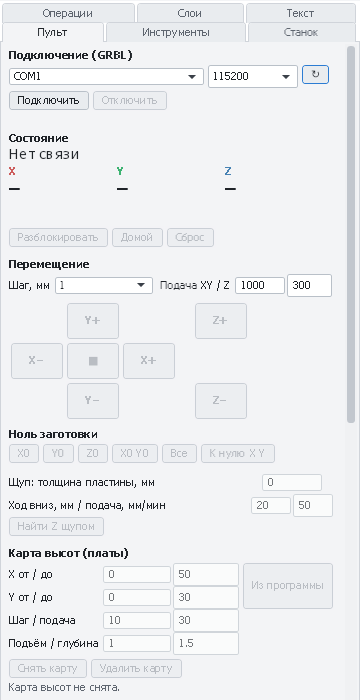

# Проверка и первый запуск CNC 3018 Pro только с лазерным модулем

Пошаговая проверка станка CNC 3018 Pro (или похожего на GRBL 1.1), на котором стоит **только диодный лазерный
модуль** 5–10 Вт — без шпинделя. От сборки до первой гравировки и первой вырезанной детали из PathForge.
На всё уходит 1–2 часа. Не пропускайте шаги: почти все неприятности первого запуска (лазер не включается,
горит постоянно, детали не того размера, пожар на столе) ловятся на них заранее.

Есть и шпиндель? Тогда сначала [первый запуск со шпинделем](first-run-3018.md), а про лазер — разделы 5–11 ниже.

[← Назад к README](../README.md) · [Команды GRBL](grbl-commands.md) · [Плата лазером](pcb-laser.md)

---

## 0. Что понадобится

- Станок 3018 с платой GRBL 1.1 (Woodpecker и похожие) или MKS DLC32 ([её настройка](mks-dlc32.md)).
- **Лазерный модуль** 5–10 Вт оптической мощности (обычно 445–455 нм, синий) с драйвером, кабель к плате.
- **Очки под длину волны модуля** (OD 4+ на 445 нм). Не «из комплекта без маркировки» — на очках должна быть
  указана длина волны и оптическая плотность.
- **Вытяжка** или хотя бы вентилятор в окно: дым от фанеры и краски вреден.
- **Огнетушитель** (порошковый или углекислотный) или хотя бы плотная мокрая тряпка рядом.
- Под материал — **негорючая подложка**: стальной или алюминиевый лист, сотовый стол, плитка. Прожигая насквозь,
  лазер прожигает и то, что под материалом.
- Материалы для проб: картон, фанера 3 мм, обрезки дерева.
- Штангенциркуль или линейка.

---

## 1. Безопасность — до включения

- **Глаза.** Луч и даже его отражение от металла или стекла необратимо повреждают сетчатку. Очки — на всех,
  кто в комнате, всегда, когда лазер под питанием. Не смотрите на пятно без очков даже на 1 %.
- **Пожар.** Фанера и картон загораются. Не оставляйте работающий лазер ни на минуту. Не режьте медленно
  с большой мощностью без обдува — кромка начинает гореть открытым пламенем.
- **Дым.** Работайте с вытяжкой. Никогда не режьте и не гравируйте:

  | Материал | Почему |
  |---|---|
  | ПВХ, винил, искусственная кожа | Хлор: ядовитый и разъедающий газ, портит станок |
  | Поликарбонат, ABS | Горит, выделяет ядовитые газы (ABS — цианиды) |
  | Стеклотекстолит FR-4, углепластик | Ядовитый дым, лазер их всё равно не режет |
  | Пенопласт, поролон | Горит и плавится |
  | Блестящий металл, зеркала | Отражение луча |

- **Дети и животные** — подальше от станка.
- Найдите, чем **мгновенно** выключить станок (аварийная кнопка или сетевой фильтр с выключателем).

---

## 2. Механика

Станок выключен.

1. **Рама и портал.** Винты затянуты, портал не качается. Покрутите рукой ходовые винты — каретки едут
   плавно, без закусываний.
2. **Муфты** между моторами и винтами затянуты (оба винта на каждой половинке). Ослабшая муфта — самая частая
   причина «уплывающих» размеров.
3. **Люфты.** Покачайте каретки по X, Y, Z: стук — подтяните антилюфтовые гайки и ролики.
4. **Лазерный модуль** закреплён жёстко (на держателе шпинделя или своём кронштейне), **вертикально**, линза
   смотрит вниз. Модуль не должен качаться — каждое его колебание видно на гравировке.
5. **Провода** не попадают под портал во всём диапазоне хода, кабель лазера не натягивается в крайних точках.
6. **Подложка** на столе, станок на ровной негорючей поверхности.

Подробнее про механику — в [первом запуске со шпинделем, раздел 2](first-run-3018.md#2-механика).

---

## 3. Подключение лазера к плате

У лазерного модуля обычно **три провода**: +12 В, GND (земля) и **PWM/TTL** (управление мощностью).

1. **Woodpecker и похожие платы 3018.** Подключайте модуль к 3-контактному разъёму **LASER** (или «PWM»/«TTL»)
   на плате — его распиновка подписана на плате и в инструкции к модулю. **Не** подключайте лазер к
   2-контактному разъёму мотора шпинделя: там силовой выход, модуль может включиться на полную мощность
   или сгореть.
2. **MKS DLC32:** разъём лазера на плате, ШИМ — GPIO32 (см. [инструкцию](mks-dlc32.md)).
3. Модули с **собственным блоком питания** 12 В: от платы идут только PWM и GND (земля общая обязательно).
4. Если на модуле есть **переключатель режимов** (например, «TTL / постоянный») — поставьте **TTL/PWM**.
   В постоянном режиме лазер может гореть всё время, пока есть питание.
5. Проверьте, что при включении питания станка лазер **не загорается** (в очках!). Горит сразу и ярко — немедленно
   выключите питание: неверное подключение или режим модуля.

---

## 4. Подключение к PathForge

1. Установите драйвер **CH340**, если Windows не определила порт.
2. Закройте LaserGRBL, LightBurn, Candle — всё, что держит COM-порт.
3. Включите питание станка, подключите USB.
4. PathForge → вкладка **«Пульт»** → COM-порт (↻ обновляет список), скорость **115200** → **«Подключить»**.
   В консоли — `Grbl 1.1…`, состояние **«Готов»**. Если **«Авария»** — нажмите **«Разблокировать»** (`$X`).

   

Плата по WiFi (MKS DLC32) — подключение по сети описано в [инструкции по DLC32](mks-dlc32.md).

---

## 5. Настройки GRBL для лазера

В консоли наберите `$$` + Enter. Сверьтесь с таблицей и исправьте отличающееся (например, `$32=1` + Enter).
Что значит каждая настройка — в [справочнике по командам GRBL](grbl-commands.md#7-настройки-0132).

| Настройка | Что значит | Что должно быть |
|---|---|---|
| `$32` | **Лазерный режим** | **`1`**: на холостых ходах (G0) луч гаснет сам, с `M4` мощность уменьшается на разгоне и в углах (нет пережога), смена мощности не останавливает движение |
| `$30` | Значение S при максимуме | **`1000`** — PathForge пишет мощность S0…S1000 (профили «лазер 5 Вт / 10 Вт») |
| `$31` | Минимум S | `0` |
| `$13` | Единицы отчётов | `0` — миллиметры |
| `$20`, `$21`, `$22` | Мягкие пределы, концевики, дом | `0` у штатного 3018 без концевиков |
| `$100`, `$101` | Шагов на мм по X, Y | Часто `800` — проверьте на шаге 7 |
| `$110`, `$111` | Максимальная скорость X, Y, мм/мин | Для гравировки картинок удобно 2000–3000. Поднимайте постепенно и проверяйте (шаг 6): винтовой 3018 на большой скорости может пропускать шаги |
| `$120`, `$121` | Ускорения | Заводские; для гравировки картинок можно чуть поднять, если станок не пропускает шаги |
| `$1` | Задержка отключения моторов | Заводская |

После изменений ещё раз `$$` — значения должны сохраниться.

---

## 6. Направления осей

**«Пульт» → «Перемещение»**, шаг **10 мм**. Направления в G-code — это движение **лазера относительно стола**:

| Кнопка | Что должно произойти на 3018 |
|---|---|
| **X+** | Лазер едет **вправо** |
| **Y+** | Стол едет **на вас** (лазер относительно стола уходит назад) |
| **Z+** | Лазер едет **вверх** (если ось Z есть и модуль на ней) |

Едет наоборот — поменяйте бит оси в `$3`: X = 1, Y = 2, Z = 4 (например, перевернуть X и Y → `$3=3`).

Проверьте и **скорость**: шаг 50 мм, подача 3000 (или ваша `$110`). Станок едет ровно, без рычания и щелчков —
хорошо. Рычит и останавливается — пропуск шагов: уменьшите `$110`/`$111`.

---

## 7. Первая проверка луча

Все в очках, на столе — кусок **картона** на негорючей подложке.

1. Подведите лазер к середине картона.
2. Если у модуля есть **кнопка теста** — коротко нажмите её: на картоне должна появиться точка.
3. Тест из консоли: отправьте по очереди
   ```
   G91
   M3 S50
   G1 X10 F600
   M5
   G90
   ```
   В лазерном режиме луч горит только во время движения `G1`: должна получиться слабая линия 10 мм (5 % мощности).
   Затем то же с `S300` — линия заметно темнее.
4. Линии нет ни при какой мощности — проверьте подключение (шаг 3), `$32`, `$30`, режим TTL на модуле.
   Лазер горит и **после `M5`** — выключите питание: неверное подключение.

---

## 8. Фокусировка

Луч работает, только когда пятно на поверхности **минимальное**. Расфокусированный луч слабый и широкий.

- **Модуль с фиксированным фокусом** (часто 10 Вт): в комплекте мерная ножка или указано расстояние от низа модуля
  до материала (например, 20 мм). Опустите модуль (Z или кронштейн) до этого расстояния.
- **Модуль с регулируемой линзой**:
  1. Временно `$32=0`, затем `M3 S10` — пятно светится, но почти не жжёт (в очках!).
  2. Вращайте линзу, пока пятно не станет **самой маленькой чёткой точкой**.
  3. `M5`, затем **обязательно** верните `$32=1`.

**Лесенка фокуса** (точнее, если модуль на оси Z). Сохраните текст ниже в файл `focus.nc`, выставьте лазер
над фанерой в примерный фокус → **«Все»** (ноль X/Y/Z), «Пульт» → **«Файл…»** → `focus.nc` → **▶ Старт**:

```
G21 G90
M4 S0
G0 X0 Y0 Z-2
G1 X30 F600 S500
G0 X0 Y3 Z-1.5
G1 X30 S500
G0 X0 Y6 Z-1
G1 X30 S500
G0 X0 Y9 Z-0.5
G1 X30 S500
G0 X0 Y12 Z0
G1 X30 S500
G0 X0 Y15 Z0.5
G1 X30 S500
G0 X0 Y18 Z1
G1 X30 S500
G0 X0 Y21 Z1.5
G1 X30 S500
G0 X0 Y24 Z2
G1 X30 S500
M5
G0 Z0
M30
```

Самая **тонкая и тёмная** линия — фокус. Например, лучшая — четвёртая снизу (Z −0,5): опустите лазер на 0,5 мм и
выставьте там Z0. Дальше фокус выставляйте всегда на **поверхности материала**.

**Размер пятна** — ширина лучшей линии под лупой (обычно 0,08–0,15 мм). Он понадобится как диаметр лазера
в инструментах PathForge.

---

## 9. Калибровка размеров

Проверьте, что 50 мм в программе — это 50 мм на материале.

1. PathForge: **Файл → Новый проект**, вкладка **«Станок»** → профиль **«CNC 3018 Pro (лазер 5 Вт)»** или
   **«(лазер 10 Вт)»** → **«Применить»**. Ноль X/Y — **«Левый нижний угол»**.
2. **«Инструменты»** → пресет **«Лазер: Лазерный модуль 5 Вт (пятно ≈0,15)»** или **«10 Вт»** → «Добавить»;
   впишите в **диаметр** измеренное пятно.
3. **Файл → Импорт чертежа** → [`samples/demo-sign.svg`](../samples/demo-sign.svg) (табличка 118 × 58 мм)
   или любой DXF/SVG с квадратом 50 × 50 мм.
4. Выделите наружный контур → **«+ Лазер»**, режим **«По линии»**, мощность **20 %**, скорость **1000** —
   только чтобы оставить след на картоне.
5. Подведите лазер к углу картона → **X0 Y0**, **▶ Старт**.
6. Измерьте: если вышло не 118 мм (или не 50), новое `$100 = старое × нужное / измеренное`; то же для Y (`$101`).
   Ошибка ровно в 2 раза — неверный `$10x`; доли миллиметра — люфт или муфта, а не настройки.

---

## 10. Подбор режимов тест-сеткой

Каждый материал и модуль — свои режимы. Тест-сетка сразу показывает, что получится.

1. Фанера 3 мм (или ваш материал) на подложке, лазер сфокусирован на её поверхности, Z0 — там же.
2. Вкладка **«Операции»** → **«Тест лазера: мощность × скорость»**:
   - **гравировка**: мощность 20…100 %, 5 шагов; скорость 600…3000, 5 шагов; квадрат 8 мм; «Рез (контур)» выключен;
   - **резка**: то же с включённым «Рез (контур)», скорость 100…600.
3. **«+ Тест-сетка лазера»** → ноль X0 Y0 в углу материала → **▶ Старт**.
4. Выберите квадрат с нужным оттенком (гравировка) или самый быстрый, который прорезал насквозь (резка).
   Значения мощности и скорости выжжены рядом с рядами и столбцами.

Ориентиры для фанеры 3 мм:

| Модуль | Гравировка | Резка насквозь |
|---|---|---|
| 5 Вт | 40–60 %, 1500–2500 мм/мин | 100 %, 150–250 мм/мин, 3–6 проходов |
| 10 Вт | 30–50 %, 2000–3000 мм/мин | 100 %, 200–300 мм/мин, 1–2 прохода, **с обдувом** |

---

## 11. Первая работа

Табличка из комплекта: [`samples/demo-sign.svg`](../samples/demo-sign.svg) — контур 118 × 58 мм, два отверстия
и звезда.

1. Новый проект с профилем лазера и лазерным инструментом (шаг 9). **Файл → Импорт чертежа** → `demo-sign.svg`.
2. Слой **«Гравировка»** («Слои» → «Выделить») → **«+ Лазер»**: режим **«Заливка и обводка»**, мощность и скорость —
   гравировка из тест-сетки, шаг заливки 0,1.
3. Слой **«Отверстия»** → **«+ Лазер»**: **«По линии»**, режим резки из тест-сетки, проходы; **«Ширина реза»** —
   «Отверстия в размер» (ширину реза измерьте: вырежьте квадрат 20 мм, ширина реза = 20 − размер).
4. Слой **«Контур»** → **«+ Лазер»**: резка, «Детали в размер». Порядок операций: гравировка → отверстия → контур
   последним (иначе деталь сдвинется, когда освободится).
5. Вкладка **«Сообщения»**: без предупреждений. **«3D-симуляция»** — посмотреть следы лазера.
6. **Пробный проход без прожига.** Временно поставьте во всех операциях мощность **1 %** (в очках виден слабый
   свет точки) и запустите: проверьте, что всё помещается на материал и ничего не задевает. Затем верните мощность.
7. Материал на подложке, фокус на поверхности, ноль X0 Y0 в левом нижнем углу (с запасом 5 мм) → **▶ Старт**.
   Не отходите: при открытом пламени — **❚❚ Пауза** или **■ Стоп** и потушить.
8. После резки дайте детали остыть, не трогайте горячую кромку.

Подробнее о лазерных операциях — в разделе README [«Лазерный модуль»](../README.md#лазерный-модуль), о платах
лазером — в [отдельной инструкции](pcb-laser.md).

---

## 12. Если что-то пошло не так

| Признак | Причина и что делать |
|---|---|
| Лазер не включается совсем | Подключение (шаг 3), режим TTL на модуле, `$32=1`, `$30=1000`, профиль лазера в PathForge. В консоли проверьте линией из шага 7 |
| Лазер горит постоянно, даже при `M5` | **Сразу выключите питание.** Модуль подключён к силовому выходу шпинделя или стоит в постоянном режиме |
| Лазер светится на холостых ходах (линии между деталями) | `$32=0` — включите `$32=1` |
| Слабая гравировка, широкие линии | Расфокус: шаг 8. Грязная линза — протрите спиртом |
| Не прорезает | Больше проходов или меньше скорость; фокус; для толстой фанеры — «Опускать Z за проход» 0,3–0,5 мм; обдув |
| Кромка чёрная, горит | Нужен обдув (air assist); меньше проходов на 100 % вместо многих медленных |
| В углах пережог (тёмные точки) | Используется `M4` (PathForge так и делает) и `$32=1`. Проверьте `$32` |
| Картинка «рваная», строки сдвинуты | Гравировка «в обе стороны» на большой скорости: люфт. Выключите «В обе стороны» или снизьте скорость; подтяните люфты |
| Размер «плывёт», рисунок съехал | Пропуск шагов: снизьте `$110`/`$111` и скорость гравировки, проверьте муфты |
| `error:20` и т. п. | Строку не понимает GRBL — проверьте формат **GRBL** на вкладке «Станок» и [коды ошибок](grbl-commands.md#9-коды-ошибок-errorn) |
| Предупреждение PathForge «Лазерные операции при профиле фрезера» | Выберите профиль лазера на вкладке «Станок» |
