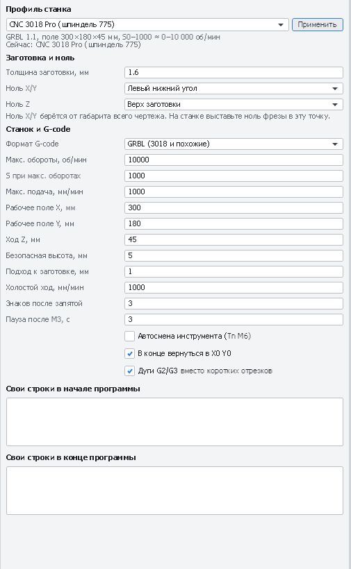

# Проверка и первый запуск CNC 3018 Pro (штатный шпиндель 775)

Пошаговая проверка нового или только что собранного станка CNC 3018 Pro со штатным шпинделем 775
и платой GRBL 1.1 (Woodpecker и похожие), а затем первый настоящий рез из PathForge.
На всё уходит 1–2 часа. Не пропускайте шаги: почти все неприятности первого запуска
(фреза уходит не в ту сторону, деталь получается не того размера, фреза врезается в стол)
ловятся на них заранее.

[← Назад к README](../README.md)

---

## 0. Что понадобится

- Компьютер с Windows и PathForge, USB-кабель из комплекта станка.
- Штангенциркуль (или хотя бы линейка) и лист обычной бумаги.
- Ключи для цанги ER11 (обычно в комплекте) и шестигранники.
- Фреза 1-заходная Ø3,175 мм для дерева (в PathForge она уже есть в новом проекте как **T1**).
- Для первого реза: фанера или МДФ толщиной 6 мм, кусок не меньше 180 × 120 мм,
  струбцины или прижимы и двусторонний скотч. Под заготовку — жертвенный лист (обрезок фанеры/МДФ),
  чтобы при сквозном резе не повредить алюминиевый стол.
- Защитные очки. Беруши или наушники тоже пригодятся: 775-й шумный.

## 1. Безопасность — до включения

- Работайте в очках: стружка летит в лицо.
- Длинные волосы собраны, рукава закатаны, без перчаток рядом с вращающейся фрезой.
- Найдите, чем выключить станок **мгновенно**: аварийная кнопка (если она есть на вашей версии)
  или выключатель питания / сетевой фильтр. Держите руку рядом с ним во время первых запусков.
- Не оставляйте работающий станок без присмотра.

## 2. Механика

Станок выключен.

1. **Рама и портал.** Все винты рамы затянуты, портал не качается. Рукой (медленно!) покрутите
   ходовые винты: каретки должны ехать плавно по всей длине, без закусываний.
2. **Муфты.** Муфты между моторами и ходовыми винтами: оба стопорных винта на каждой половинке затянуты,
   желательно на лыске вала. Ослабшая муфта — самая частая причина «пропуска шагов» и неправильных размеров.
3. **Люфты.** Возьмитесь за шпиндель и покачайте его по X, Y и Z. Заметный стук — подтяните гайки
   ходовых винтов (антилюфтовые) и эксцентрики/ролики.
4. **Шпиндель.** Крепление 775-го в держателе затянуто. Цанга ER11 и гайка чистые.
   Фрезу вставляйте в цангу минимум на 2/3 длины цанги (≈ 10–12 мм хвостовика), вылет — минимальный
   нужный для глубины реза. Гайку затягивайте двумя ключами, без фанатизма.
5. **Провода.** Разъёмы моторов вставлены до конца, провода не попадают под портал и стол
   во всём диапазоне хода. Провод шпинделя не натянут в крайних положениях.

## 3. Подключение к PathForge

1. Установите драйвер **CH340** (плата Woodpecker использует этот USB-чип), если Windows
   не определила порт сама.
2. Закройте Candle, GRBLControl, Arduino IDE и всё, что может держать COM-порт.
3. Включите питание станка, подключите USB.
4. В PathForge откройте вкладку **«Пульт»** → выберите COM-порт (кнопка ↻ обновляет список),
   скорость **115200** → **Подключить**.

   

5. В консоли внизу вкладки появится ответ платы вида `Grbl 1.1f ['$' for help]`, состояние станет
   **«Готов»**. Если состояние **«Авария»** — станок ничего не делал, это нормально после включения
   на некоторых прошивках: нажмите **«Разблокировать»** (`$X`).

Нет ответа? Попробуйте другой порт, другой USB-кабель/разъём и скорость 115200 (на старых
прошивках бывает 9600). Если порт «занят» — его держит другая программа.

## 4. Настройки GRBL

В поле консоли наберите `$$` и нажмите Enter — плата выдаст все настройки. Чтобы сохранить их или переслать, щёлкните журнал правой кнопкой → «Копировать весь журнал». Ничего не меняйте наугад;
сверьтесь с таблицей. Изменить настройку: например `$32=0` + Enter.

| Настройка | Что значит | Что должно быть для 3018 Pro со шпинделем 775 |
|---|---|---|
| `$13` | Единицы отчётов | `0` — миллиметры (PathForge рассчитывает на мм) |
| `$20`, `$21`, `$22` | Мягкие пределы, концевики, поиск дома | `0` — у штатного 3018 Pro концевиков обычно нет. Если вы их поставили — `$21=1`, `$22=1` |
| `$30` | Обороты при максимальном S | `1000` — PathForge пишет обороты в диапазоне S0…S1000 (профиль «CNC 3018 Pro (шпиндель 775)») |
| `$31` | Минимальные обороты | `0` |
| `$32` | Лазерный режим | **`0`** для шпинделя! С `$32=1` шпиндель будет останавливаться на каждом холостом ходе |
| `$100`, `$101`, `$102` | Шагов на мм по X, Y, Z | Часто `800`, но зависит от винтов и микрошага — проверьте измерением (шаг 6) |
| `$110`, `$111`, `$112` | Максимальная скорость, мм/мин | Заводские значения (обычно около 1000 для X/Y). Для первых запусков не повышайте |
| `$120`, `$121`, `$122` | Ускорения | Заводские |
| `$3` | Инверсия направлений | Подбирается на шаге 5 |
| `$1` | Задержка отключения моторов | Заводская. Если ось Z проседает под весом шпинделя при остановке — `$1=255` (моторы держат всегда) |

После изменений ещё раз выполните `$$` и проверьте, что значения сохранились.

*Консоль вкладки «Пульт»: ответы на `$$`, `$I` и `$G` (новые строки сверху).*

## 5. Направления осей

Перемещение кнопками на вкладке **«Пульт»** → **«Перемещение»**. Шаг — **1 мм**, подача 1000 / 300.
Сначала поднимите фрезу кнопкой **Z+** на 10–20 мм, чтобы ничего не задеть.

Направления в G-code — это движение **фрезы относительно заготовки**:

| Кнопка | Что должно произойти на 3018 |
|---|---|
| **X+** | Шпиндель едет **вправо** |
| **Y+** | Стол едет **на вас** (то есть фреза относительно стола уходит назад) |
| **Z+** | Шпиндель едет **вверх** |

Если какая-то ось едет наоборот — поменяйте её бит в `$3`: X = 1, Y = 2, Z = 4.
Например, неверно X и Z → `$3=5`; было `$3=2` и нужно перевернуть ещё X → `$3=3`.
После изменения проверьте все три оси ещё раз.

Кнопка **■** в центре креста останавливает перемещение.

## 6. Калибровка шагов (размеры детали)

Проверьте, что 10 мм в программе — это 10 мм на станке.

1. Выберите шаг **10 мм**. Закрепите на столе линейку или используйте штангенциркуль
   между неподвижной частью рамы и кареткой.
2. Запомните положение, нажмите **X+** пять раз (50 мм), измерьте фактическое перемещение.
3. Если вышло не 50 мм: новое значение `$100 = старое × 50 / измеренное`.
   Например, `$100=800`, проехало 25 мм → `$100=1600`; проехало 100 мм → `$100=400`.
4. То же для Y (`$101`) и Z (`$102`, перемещение 10–20 мм вверх).

Ошибка в 2 раза почти всегда значит неверный `$10x`; ошибка в долях миллиметра — люфт или
ослабшая муфта (шаг 2), а не настройки.

## 7. Шпиндель 775

Фреза **не** установлена (цанга и гайка на месте и затянуты), шпиндель поднят.

1. В консоли: `M3 S300` → шпиндель должен плавно раскрутиться (≈ 3000 об/мин).
2. **Направление вращения**: если смотреть сверху на шпиндель — **по часовой стрелке**.
   Против часовой — выключите питание и поменяйте местами два провода шпинделя на плате.
   Обычная фреза при обратном вращении не режет, а горит и ломается.
3. `M3 S1000` — полные обороты (≈ 10 000 об/мин) на 10–20 секунд. Сильная вибрация, биение,
   запах — повод проверить цангу и крепление.
4. `M5` — остановка.

PathForge после `M3` ждёт 3 секунды (настройка «Пауза после M3» на вкладке «Станок»), чтобы
775-й успел раскрутиться до врезания.

## 8. Ноль Z и щуп

**Бумажкой** (без щупа): подведите фрезу над заготовкой, опускайте **Z−** шагом 0,1, затем 0,01 мм,
пока лист бумаги между фрезой и заготовкой не начнёт подклинивать → **Z0**.

**Щупом** (если есть пластина с проводами):

1. Сначала проверьте, что щуп срабатывает. Поднимите фрезу на 15–20 мм над столом, наденьте зажим
   на фрезу, пластину держите в руке. Нажмите **«Найти Z щупом»** (ход вниз 20 мм, подача 50)
   и, пока фреза опускается, коснитесь пластиной фрезы — движение должно **сразу остановиться**.
   Не остановилось — нажмите **«Сброс»** и проверьте провода щупа.
2. Теперь по-настоящему: пластина на заготовке под фрезой, в поле «Щуп: толщина пластины» — её
   толщина, **«Найти Z щупом»**. Z0 встанет на поверхность заготовки.
3. Снимите зажим с фрезы перед запуском программы.

## 9. Подготовка программы в PathForge

Для первого реза — демо-деталь из комплекта: пластина 160 × 100 мм с четырьмя отверстиями Ø5,
карманом с островом и пазом ([`samples/demo-plate.dxf`](../samples/demo-plate.dxf)).

1. **Вкладка «Станок»**: профиль **«CNC 3018 Pro (шпиндель 775)»** → «Применить» (в новом проекте он
   уже выбран). Толщина заготовки — **6**, ноль X/Y — **левый нижний угол**, ноль Z — **верх заготовки**.

   

   *Вкладка «Станок» с профилем «CNC 3018 Pro (шпиндель 775)»: обороты 10 000 = S1000, поле 300×180×45 мм, пауза 3 с после M3.*

2. **Файл → Импорт чертежа** → `samples/demo-plate.dxf`.
3. **Вкладка «Слои»** → у слоя `OUTLINE` нажмите «Выделить» → **+ Контур**:
   сторона **«Снаружи»**, глубина **6,3** (на 0,3 мм в жертвенный лист), инструмент **T1**,
   перемычки: 4 шт., высота 1–1,5 мм — деталь не вырвет в конце.
4. Слои `HOLES` и `SLOT` → **+ Контур**, сторона **«Внутри»**, глубина **6,3**.
   Отверстия Ø5 вырезаются фрезой Ø3,175 по контуру — сверло не нужно.
5. Слой `POCKET` → **+ Карман**, глубина **2**.
6. Порядок операций (кнопки ▲▼): карман → отверстия и паз → наружный контур последним.

Проверьте:

- Внизу окна — **время обработки** и длина реза; на вкладке **«Сообщения»** нет предупреждений «⚠»
  (выход за поле станка, глубина больше заготовки, подача выше максимальной).
- Вкладка **«3D-симуляция»**: прокрутите обработку ползунком — фреза не должна резать там, где не надо,
  и не должна уходить в стол глубже нескольких десятых.

## 10. Проход «по воздуху»

Самая полезная проверка перед первым резом: станок выполняет всю программу, но на 20 мм выше заготовки.

1. Закрепите заготовку (струбцины — за пределами детали плюс 10 мм, они не должны попадать под фрезу
   и портал), фреза Ø3,175 в цанге.
2. Подведите фрезу к **левому нижнему углу** заготовки (с запасом 5–10 мм от края) → **X0 Y0**.
3. Найдите поверхность заготовки (шаг 8) → **Z0**. Затем поднимите фрезу на **20 мм** (Z+ 10 мм два раза)
   и ещё раз нажмите **Z0** — теперь «поверхность» на 20 мм выше настоящей.
4. **▶ Старт**. Следите: движения совпадают с картинкой на «Чертёж (2D)», фреза не выходит за заготовку,
   портал никуда не упирается, перемычки на месте. При малейших сомнениях — **■ Стоп**.
5. После прохода: опустите фрезу до поверхности и снова выставьте **Z0** по-настоящему
   (X0 Y0 трогать не нужно).

## 11. Первый рез

1. Очки, пылесос/кисть под рукой, рука рядом с выключателем.
2. **▶ Старт**. В окне подтверждения ещё раз проверьте: заготовка закреплена, ноль X/Y/Z выставлен,
   в шпинделе нужная фреза.
3. В первые минуты слушайте станок. Ровный звук, мелкая стружка — хорошо. Визг, сильная вибрация,
   дым или чёрный край — уменьшите подачу кнопкой **Подача −10 %** (можно несколько раз).
   Сильный удар или скрежет — **■ Стоп**.
4. **❚❚ Пауза** останавливает подачу плавно, **Продолжить** — едет дальше.
   **■ Стоп** сначала тормозит, потом сбрасывает GRBL: шпиндель остановится, положение не потеряется.
5. После окончания поднимите фрезу, дождитесь остановки шпинделя, перережьте перемычки ножом.
6. Измерьте деталь штангенциркулем: 160 × 100 мм, отверстия Ø5. Ошибка в размере всей детали —
   шаг 6 (калибровка); отверстия меньше или больше — проверьте диаметр фрезы в инструменте T1.

Подачи пресетов — осторожные стартовые значения. Когда первые детали получатся, подачу можно
поднимать постепенно, по 10–20 %.

В новом проекте три инструмента. Остальные популярные фрезы под цангу ER11 — вкладка **«Инструменты»**:
выберите пресет и нажмите **«Добавить»**, **«+ Вся группа»** (например, все фрезы по дереву или все свёрла для
плат) или **«+ Все пресеты»** (вся библиотека, без повторов). Фрезы с хвостовиком 4 или 6 мм требуют цангу
ER11 того же размера.

## 12. Если что-то пошло не так

| Признак | Причина и что делать |
|---|---|
| После подключения состояние «Авария» | Нормально для некоторых прошивок после сброса. «Разблокировать» (`$X`). Если авария появилась во время работы — читайте её расшифровку в консоли |
| `error:20`, `error:22` и т. п. при старте | GRBL не понимает строку: проверьте, что на вкладке «Станок» выбран формат **GRBL**, а не «Общий» |
| Деталь в 2 раза больше/меньше | Неверные `$100`–`$102` (шаг 6) |
| Размер «плывёт», слои сдвинуты | Пропуск шагов: ослабшие муфты, слишком большая подача или глубина за проход. Уменьшите подачу или «Шаг по глубине» инструмента |
| Шпиндель не крутится | `$32` должен быть `0`; `$30=1000`; провода шпинделя и питание 24 В |
| Фрезу «тянет» вниз в материал | Плохо затянута цанга: фреза выползает. Затяните гайку, вставьте хвостовик глубже |
| Ось Z проседает после остановки | `$1=255` — моторы держат постоянно |
| Края подгорают | Слишком низкая подача для 10 000 об/мин или тупая фреза. Поднимите подачу на 10–20 % |
| Связь пропадает во время работы | Помехи по USB: другой кабель, порт на задней панели ПК, ферритовые кольца, не класть USB рядом с проводом шпинделя |

Когда всё это пройдено, станок готов к работе. Дальше — разделы README про
[платы](../README.md#печатная-плата-за-5-шагов) и [работу со станком](../README.md#работа-со-станком-вкладка-пульт).
