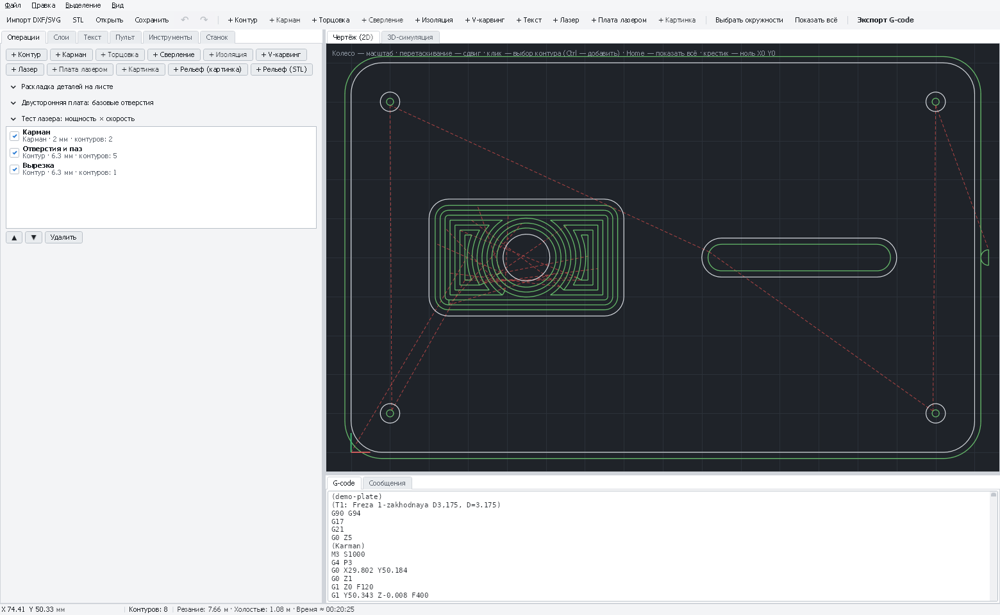

# Операции PathForge: подробные инструкции

Каждая операция — отдельная инструкция: для чего она, как её добавить, что значит каждое поле, с каких значений
начинать на CNC 3018 и что делать, если результат не тот.

[← Назад к README](../../README.md)

*Вкладка «Операции»: кнопки добавления операций, панели раскладки, двусторонней платы и тест-сетки лазера, список операций проекта и поля выбранной операции.*

## Общий порядок работы

1. **Чертёж**: «Файл → Импорт чертежа» (DXF, SVG), файлы платы (Gerber, Excellon), STL или картинка для рельефа,
   надпись на вкладке «Текст».
2. **Инструменты**: вкладка «Инструменты» → пресет → «Добавить» (или «+ Пустой» и свои значения).
3. **Выделить контуры** на чертеже (клик, Ctrl+клик — добавить, Ctrl+A — все) или на вкладке «Слои» («Выделить», «+»).
4. **Добавить операцию** кнопкой «+ …» — она получит выделенные контуры. Потом их можно заменить кнопкой
   «Назначить выделенные».
5. **Настроить** операцию — траектории и G-code пересчитываются сразу. Проверить вкладку «Сообщения» и «3D-симуляцию».
6. **Запустить** с «Пульта» или «Экспорт G-code».

**Общие поля всех фрезерных операций**

| Поле | Что значит |
|---|---|
| Название | Только для вас, в G-code не попадает |
| Включена | Выключенная операция не попадает в G-code и в симуляцию — удобно запускать операции по одной |
| Инструмент | Фреза, гравёр, сверло или лазер из списка инструментов проекта |
| Глубина, мм | На сколько опуститься ниже начала (положительное число) |
| Начало (Z), мм | Откуда считать глубину: 0 — верх заготовки, −2 — на 2 мм ниже (например, второй уровень после кармана) |
| Контуры | Сколько контуров у операции; «Назначить выделенные» заменяет их выделенными на чертеже |
| Врезание | Как фреза входит в материал: вертикально, рампой (зигзаг) или по спирали; угол рампы 2–5° для 3018 |

Порядок операций — кнопки ▲ ▼ рядом со списком: сначала то, что внутри (карманы, отверстия), наружный контур — последним.

## Фрезерные операции

| Операция | Инструкция |
|---|---|
| **Контур** — вырезать деталь, отверстие, паз, гравировать по линии | [profile.md](profile.md) |
| **Карман** — выбрать материал внутри контура (обычный, адаптивный, дообработка) | [pocket.md](pocket.md) |
| **Сверление** — отверстия в центрах окружностей, пазы | [drilling.md](drilling.md) |
| **Торцовка** — выровнять жертвенный стол или верх заготовки | [facing.md](facing.md) |
| **V-карвинг** — надписи и узоры V-фрезой с острыми углами | [vcarve.md](vcarve.md) |
| **Рельеф 3D** — поверхность из картинки или STL, дообработка остатков | [relief-3d.md](relief-3d.md) |
| **Изоляция** — печатная плата гравёром | [../pcb-milling.md](../pcb-milling.md) |

## Лазерные операции

| Операция | Инструкция |
|---|---|
| **Лазер** — резка, обводка, заливка контуров | [laser-vector.md](laser-vector.md) |
| **Картинка** — гравировка фото и рисунков | [laser-picture.md](laser-picture.md) |
| **Тест-сетка лазера** — подбор мощности и скорости | [laser-test-card.md](laser-test-card.md) |
| **Плата лазером** — краска + травление | [../pcb-laser.md](../pcb-laser.md) |

## Подготовка и проверка

| Что | Инструкция |
|---|---|
| **Текст** — надписи любым шрифтом, по дуге | [text.md](text.md) |
| **Раскладка деталей на листе**, в том числе в отверстия других деталей | [nesting.md](nesting.md) |
| **3D-симуляция** и сравнение с моделью | [simulation.md](simulation.md) |
