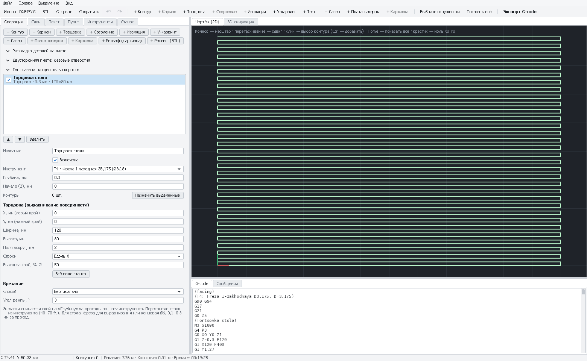

# Торцовка: выравнивание стола и заготовки

Прямоугольная область фрезеруется зигзагом в размер: после неё поверхность строго параллельна движению станка.
На 3018 это нужно почти каждому: **выровнять жертвенный стол** (иначе карманы и платы выходят разной глубины)
или снять кривой верх заготовки.

*Торцовка области 120×80 мм зигзагом с перекрытием проходов.*

[← Все операции](README.md)

---

## Как добавить

- **Жертвенный стол целиком**: новый проект → **«+ Торцовка»** → **«Всё поле станка»** (для 3018 — 300 × 180 мм).
- **Верх заготовки под деталь**: выделите контуры детали → «+ Торцовка» — область = их габарит плюс «Поля вокруг».
- **Свой прямоугольник**: без выделения — задайте X, Y, ширину и высоту.

## Поля

| Поле | Что значит | С чего начать |
|---|---|---|
| **Инструмент** | Фреза побольше: «Фреза Ø6 для выравнивания стола» из пресетов или Ø3,175 (дольше) | Ø6 |
| **Глубина, мм** | Сколько снять всего; делится на проходы по «Шагу по глубине» инструмента | 0,3–0,5 для стола |
| **X, Y, Ширина, Высота** | Область, когда контуры не назначены (в координатах чертежа). В проекте без контуров её левый нижний угол и есть ноль X0 Y0 | — |
| **Поля вокруг, мм** | Когда назначены контуры: насколько область больше их габарита | 2 |
| **Строки** | Вдоль X или вдоль Y — проходы вдоль длинной стороны дают меньше разворотов | Вдоль X |
| **Выход за край, % Ø** | Насколько край фрезы выходит за область. 50 — центр фрезы доходит до края (края и углы обработаны). Меньше 21 % — углы останутся | 50 |
| **Врезание** | Вертикально или рампой вдоль первой строки | Вертикально (глубина маленькая) |

Перекрытие строк — «Перекрытие, % Ø» инструмента: 50–70 % даёт ровную поверхность без гребешков.

## Пошагово: выровнять жертвенный стол

1. Привинтите к столу лист МДФ или фанеры 10–16 мм (винты утоплены, ниже глубины торцовки).
2. **Файл → Новый проект**. «Инструменты» → «Общее: Фреза Ø6 для выравнивания стола» → «Добавить».
3. **«+ Торцовка»** → **«Всё поле станка»**. Глубина **0,5**. Шаг по глубине в инструменте **0,25** — 2 прохода.
4. На станке: подведите фрезу в **левый нижний угол хода** → **X0 Y0**. Z0 — на **самой высокой** точке листа
   (проверьте бумажкой в нескольких местах; можно снять карту высот, чтобы увидеть перекос).
5. **▶ Старт**, пылесос рядом — пыли много. Если после прохода остались необработанные пятна — ещё один проход
   на 0,2–0,3 мм.
6. Не трогайте лист после выравнивания: если его снять и поставить обратно, плоскость снова будет немного под углом.

## Если что-то не так

| Признак | Что делать |
|---|---|
| Гребешки между строками | Больше перекрытие в инструменте (60–70 %) |
| Пятна не обработаны | Стол перекошен сильнее глубины: ещё проход или Z0 по самой высокой точке |
| Ступенька между проходами в одну и другую сторону | Фреза не перпендикулярна столу (шпиндель наклонён) — выставьте шпиндель |
| «Углы области останутся необработанными» | «Выход за край» меньше 21 % — увеличьте |
| Ноль оказался не там | Без контуров ноль — левый нижний угол области торцовки (X, Y). С контурами — угол всего чертежа |
