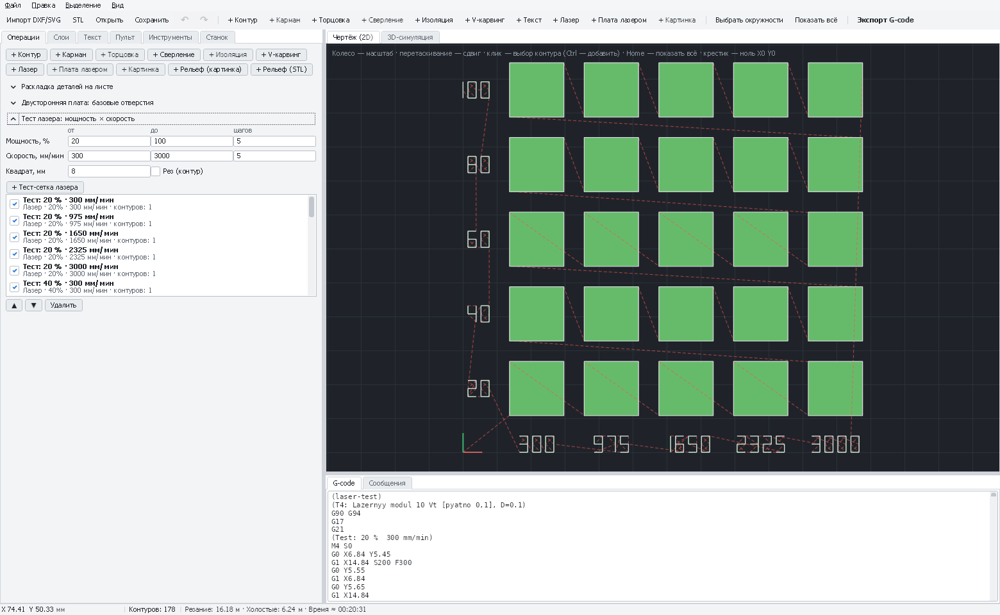

# Тест-сетка лазера: подбор мощности и скорости

Сетка квадратов, выжженных с разной мощностью (ряды снизу вверх) и скоростью (столбцы слева направо), с выжженными
подписями значений. Одна сетка на обрезке материала показывает, какой режим даёт нужный оттенок или прорезает насквозь.

*Тест-сетка 5×5: мощность 20–100 % (ряды) × скорость 300–3000 мм/мин (столбцы), подписи значений выжигаются рядом.*

[← Все операции](README.md)

---

## Как добавить

1. Профиль лазера и лазерный инструмент (см. [«Лазер»](laser-vector.md#перед-началом)). Лучше в **отдельном проекте**
   («Файл → Новый проект»): контуры сетки потом не удалить из чертежа, только скрыть слой «Laser test».
2. Вкладка «Операции» → раскройте **«Тест лазера: мощность × скорость»**.
3. Задайте диапазоны → **«+ Тест-сетка лазера»**. Сетка встанет справа от чертежа; каждый квадрат — своя операция
   с названием «Тест: 60 % · 1500 мм/мин».

## Поля

| Поле | Что значит | Гравировка | Резка |
|---|---|---|---|
| **Мощность, %: от, до, шагов** | Ряды снизу вверх | 20…100, 5 | 60…100, 3 |
| **Скорость, мм/мин: от, до, шагов** | Столбцы слева направо | 600…3000, 5 | 100…600, 5 |
| **Квадрат, мм** | Сторона квадрата | 8 | 10 |
| **Рез (контур)** | Выключено — квадраты заливаются (тест гравировки). Включено — квадраты вырезаются по контуру (прорезало ли насквозь) | Выкл. | Вкл. |

## Как читать результат

- **Гравировка**: выберите квадрат с нужным оттенком. Из нескольких одинаковых выбирайте с большей скоростью — быстрее
  и меньше нагрев.
- **Резка**: самый быстрый квадрат, который выпал сам (или держится на волосках). Для запаса скорость на 10–20 % меньше.
- **Плата лазером** (краска на меди): квадрат, где медь чистая и блестящая после промывки ([подробно](../pcb-laser.md#6-подбор-мощности-и-скорости-тест-сеткой)).

Значения переносите в операции «Лазер», «Картинка» или «Плата лазером».

## Советы

- Тест делайте на той же партии материала и с тем же фокусом, что и работу.
- Для резки толстого материала включите в квадратах «Проходов» побольше — каждую операцию сетки можно отредактировать.
- Модуль 10 Вт режет с обдувом; без обдува результаты резки хуже.
