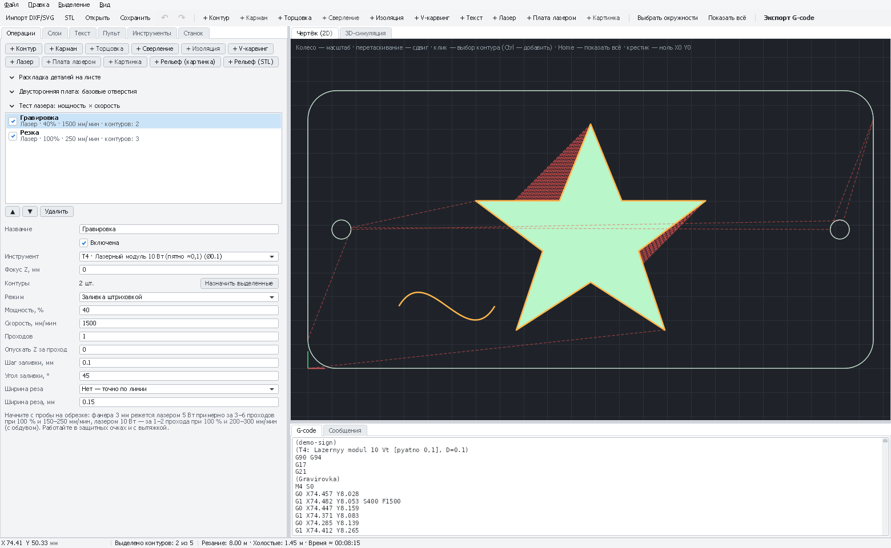

# Лазер: резка, обводка и заливка контуров

Лазерный модуль идёт по выбранным контурам: **по линии** (резка, обводка), **заливкой** — штриховкой внутри
замкнутых контуров (гравировка площадей) или и то и другое. Z не двигается (кроме опускания фокуса между проходами),
мощность — словом `S` в каждом рабочем ходе, `M4` в лазерном режиме GRBL.

*Табличка из SVG: «Гравировка» заливкой внутри звезды и резка по наружному контуру лазером 10 Вт.*

[← Все операции](README.md) · [Первый запуск 3018 с лазером](../first-run-3018-laser.md)

---

## Перед началом

1. «Станок» → профиль **«CNC 3018 Pro (лазер 5 Вт)»** или **«(лазер 10 Вт)»** → «Применить». В GRBL — `$32=1`, `$30=1000`.
2. «Инструменты» → пресет «Лазер: Лазерный модуль 5 Вт» или «10 Вт» → «Добавить». **Диаметр** инструмента — размер пятна.
3. Режим для материала — [тест-сеткой](laser-test-card.md).

## Как добавить

Выделите контуры → **«+ Лазер»**. Новая операция режет по линии с включённым обдувом.

## Поля

| Поле | Что значит | С чего начать |
|---|---|---|
| **Инструмент** | Лазер | — |
| **Фокус Z, мм** | Высота фокуса относительно Z0; 0 — сфокусировано на поверхности ([тест фокуса](laser-focus-test.md)) | 0 |
| **Обдув (M8/M7)** | Воздух на время операции: перед ней `M8` (или `M7` — вкладка «Станок», «Обдув лазера»), после — `M9`. Включается сам в режиме «По линии» и выключается при заливке; галочку можно поставить и снять вручную | Вкл. для резки, выкл. для гравировки |
| **Режим** | **По линии** — резка и обводка. **Заливка штриховкой** — площади внутри замкнутых контуров (вложенные — дырки). **Заливка и обводка** — сначала заливка, потом ровный край | — |
| **Мощность, %** | От максимума (`S1000` = 100 %) | Из тест-сетки |
| **Скорость, мм/мин** | Медленнее — глубже и темнее | Из тест-сетки |
| **Проходов** | Сколько раз повторить | 1 гравировка; 2–6 резка |
| **Опускать Z за проход** | Для толстой фанеры: фокус опускается на столько после каждого прохода | 0,3–0,5 при резке 4–6 мм |
| **Шаг заливки, мм** | Расстояние между линиями штриховки: меньше — плотнее и темнее | 0,1 (около пятна) |
| **Угол заливки, °** | Направление штриховки | 0 (вдоль X) или 45 |
| **Ширина реза** | Луч выжигает полоску 0,1–0,3 мм: **«Детали в размер»** — наружные контуры отодвигаются наружу, отверстия внутрь на половину ширины реза; **«Отверстия в размер»** — наоборот (вставки, пазы под шип) | Нет / «Детали в размер» для резки |
| **Ширина реза, мм** | Вырежьте квадрат 20 мм и измерьте: ширина реза = 20 − размер | 0,1–0,2 |
| **Микроперемычки** | Сколько перемычек оставить на каждом **наружном** контуре (0 — нет). На перемычке луч гаснет, и деталь держится в листе: не выпадает сквозь стол и не встаёт на ребро под соплом. Отверстия режутся без перемычек. Только для режимов с линией | 0; 2–4 для мелких деталей |
| **Ширина перемычки, мм** | Сколько материала остаётся; разрыв в резе = ширина + пятно лазера (диаметр инструмента). Перемычки ставятся равномерно по контуру, во всех проходах | 0,3–0,5 фанера, 0,2–0,3 акрил |

## Микроперемычки

Вырезанная деталь падает в ячейку стола или встаёт на ребро, и сопло на следующем проходе цепляет её. Перемычки
оставляют деталь в листе до конца работы: после — выломайте её и зачистите следы шкуркой или ножом.

- Перемычки нужны только на **последней** резке детали (наружный контур). Отверстия режутся без них — их обрезки
  пусть выпадают.
- Если контур слишком короткий для заданного числа перемычек, PathForge режет его без перемычек и предупреждает.
- Перемычки видны на 2D-виде как разрывы линии реза (холостые ходы), в 3D-симуляции — как невыжженные участки.

## Обдув (air assist)

Компрессор аквариумного типа или специальный насос подключите через реле к выходу охлаждения платы (Coolant /
Flood — команда `M8`). PathForge включает его перед каждой операцией с галочкой **«Обдув»** и выключает `M9` перед
операциями без неё, перед паузой на смену инструмента и в конце программы.

- **Резка** — с обдувом: сдувает дым и пламя, кромка светлее, линза не закапчивается, рез глубже.
- **Гравировка** — без обдува: поток разносит копоть по поверхности, гравировка выходит грязнее.
- Если насос подключён к выходу Mist, выберите на вкладке «Станок» **«Обдув лазера: M7»** (GRBL понимает `M7`,
  только если собран с `ENABLE_M7`).

## Ориентиры (проверьте тест-сеткой!)

| Задача | 5 Вт | 10 Вт |
|---|---|---|
| Резка фанеры 3 мм | 100 %, 150–250 мм/мин, 3–6 проходов | 100 %, 200–300 мм/мин, 1–2 прохода, обдув |
| Гравировка фанеры (заливка) | 40–60 %, 1500–2500 мм/мин | 30–50 %, 2000–3000 мм/мин |
| Картон 1–2 мм | 60–80 %, 600–1000 мм/мин | 40–60 %, 1000–1500 мм/мин |

## Пошагово: табличка с гравировкой

1. Импорт `samples/demo-sign.svg`.
2. Слой «Гравировка» → «+ Лазер», **Заливка и обводка**, гравировочный режим.
3. Слой «Отверстия» → «+ Лазер», **По линии**, режим резки, «Отверстия в размер».
4. Слой «Контур» → «+ Лазер», **По линии**, резка, «Детали в размер». Порядок: гравировка → отверстия → контур.
5. Фокус на поверхности, X0 Y0 в углу материала → «Пульт» → **«⬚ Обвести рамку»** (лазер на 1 % проходит по
   границе задания — проверьте, что оно на материале) → «▶ Старт». Не отходите от станка.

## Если что-то не так

| Признак | Что делать |
|---|---|
| Не прорезает | Больше проходов или меньше скорость, «Опускать Z за проход», фокус, обдув |
| Кромка чёрная, горит | Обдув; меньше проходов на 100 % вместо многих медленных |
| Деталь выпала или перевернулась, сопло её задело | «Микроперемычки» 2–4 на наружном контуре |
| Перемычки не выламываются / рвут кромку | «Ширина перемычки» меньше |
| Обдув не включается | Насос на выходе Flood — `M8`, на Mist — `M7` (вкладка «Станок»); проверьте реле командой `M8` в консоли |
| Заливка полосатая | «Шаг заливки» меньше пятна; фокус |
| Деталь меньше на ширину реза | «Ширина реза: Детали в размер» с измеренной шириной |
| «Заливка возможна только внутри замкнутых контуров» | Контур не замкнут — исправьте чертёж или используйте «По линии» |
| Лазер горит на холостых ходах | `$32=1` в GRBL |
