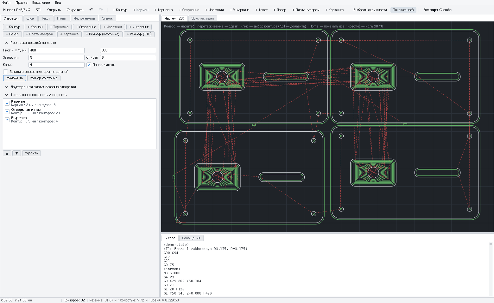

# Раскладка деталей на листе

Детали раскладываются по листу заготовки плотно, по реальной форме (а не прямоугольниками), с зазором, поворотами
и копиями. Мелкие детали можно ставить **в отверстия крупных** — материал внутри рамок и колец не пропадает.
Операции получают все копии деталей сами.

*Четыре копии демо-детали разложены на листе 400×300 мм с зазором 5 мм; операции получили все копии.*

[← Все операции](README.md)

---

## Что считается деталью

**Деталь** — замкнутый наружный контур вместе со всем, что внутри: отверстиями, гравировкой, текстом.
Контуры вне деталей (незамкнутые линии снаружи) остаются на месте — PathForge скажет, сколько их.

## Как разложить

1. Вкладка «Операции» → раскройте **«Раскладка деталей на листе»**.
2. **«Размер со станка»** — лист = рабочее поле станка, зазор = самая большая фреза + 2 мм. Или задайте свои значения.
3. Выделите детали (или ничего — тогда все) → **«Разложить»**. Отменить — **Ctrl+Z**.
4. В «Сообщениях» — сколько деталей поместилось и сколько процентов листа занято.

## Поля

| Поле | Что значит | С чего начать |
|---|---|---|
| **Лист X × Y, мм** | Размер листа; лист начинается в нуле чертежа | Размер заготовки |
| **Зазор, мм** | Между деталями: не меньше диаметра фрезы (лучше +1–2 мм), для лазера — 1–2 мм | Ø фрезы + 2 |
| **от края** | Отступ от краёв листа (крепёж, неровный край) | 5–10 |
| **Копий** | Сколько экземпляров каждой детали | 1 |
| **Поворачивать** | Поворачивать детали для плотности. Выключите для фанеры с волокнами или рисунком. Детали с текстом не поворачиваются | Вкл. |
| **Шаг поворота, °** | Через сколько градусов пробовать повороты: **90** — только 0°, 90°, 180°, 270°; **45, 15, 5** — любой угол с этим шагом. Мельче шаг — плотнее, но дольше | 90; 15 для фигурных деталей |
| **Детали в отверстиях других деталей** | Мелкие детали ставятся в сквозные отверстия крупных | См. ниже |

## Как работает

Детали ставятся от больших к маленьким, каждая — в самое нижнее, затем самое левое место, где её контур
(с зазором) не касается других, и «съезжает» вниз и влево в промежутки — детали входят друг в друга, где позволяет форма.
Из всех поворотов (с «Шагом поворота») выбирается тот, что меньше всего поднимает верх уже разложенного,
затем — самый нижний и левый: длинная деталь ляжет плашмя, а деталь, нарисованная под углом, выпрямится, если шаг
это позволяет (например, наклон 30° при шаге 15°). Не поместившиеся детали встают справа от листа (с предупреждением).

**Какой шаг выбрать.** Прямоугольные детали — 90° (быстро, кромки вдоль листа). Треугольники, шестиугольники,
звёзды, детали сложной формы и нарисованные наклонно — 15° или 5°: они плотнее входят друг в друга. Расчёт с шагом 5°
примерно в 5 раз дольше, чем с 90°, — для десятков деталей это секунды.

### Детали в отверстиях

С флажком **«Детали в отверстиях других деталей»**:

- все **замкнутые контуры внутри детали, кроме текста, считаются сквозными отверстиями**;
- мелкие детали сначала пробуют встать в отверстия уже разложенных (с тем же зазором до краёв отверстия и до соседей);
- замкнутый контур, который уже лежит внутри отверстия другой детали, — **отдельная деталь** (повторная раскладка
  её не «приклеит» к рамке).

Не включайте флажок, если внутри деталей есть **карманы с островами** (остров внутри кармана тогда посчитается
отдельной деталью).

**Порядок резки:** сначала детали в отверстии, потом само отверстие, потом наружный контур большой детали — иначе
кусок с ещё не вырезанной деталью выпадет вместе с отверстием. Внутри **одной** операции PathForge сам режет
вложенные контуры раньше наружных; между операциями порядок — как в списке (кнопки ▲ ▼).

## Пошагово: рамки и вставки из фанеры

1. Чертёж: рамка 100 × 100 с окном 70 × 70 и несколько квадратов 20 × 20.
2. Раскладка: «Размер со станка», копий **3**, флажок **«Детали в отверстиях»** → «Разложить». Квадраты встанут в окна рамок.
3. Операции **в таком порядке**: «+ Контур» **снаружи** для квадратов → «+ Контур» **внутри** для окон →
   «+ Контур» **снаружи** для рамок.
4. «3D-симуляция» — проверить, что квадраты вырезаются раньше окон.

## Если что-то не так

| Признак | Что делать |
|---|---|
| «Не поместилось деталей» | Меньше зазор/отступ/копий, включите поворот, уменьшите «Шаг поворота» (15° или 5°), больше лист |
| Детали встали под странными углами | Для прямоугольных деталей поставьте «Шаг поворота» 90 |
| Деталь «раскололась» — отверстие уехало отдельно | Отверстие не внутри наружного контура (контур не замкнут) — исправьте чертёж |
| Остров кармана стал отдельной деталью | Выключите «Детали в отверстиях» |
| Текст не поворачивается | Так задумано: надпись остаётся редактируемой |
