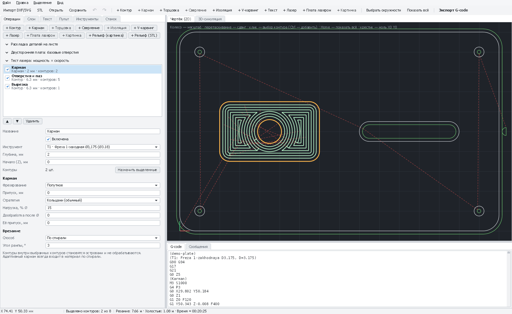
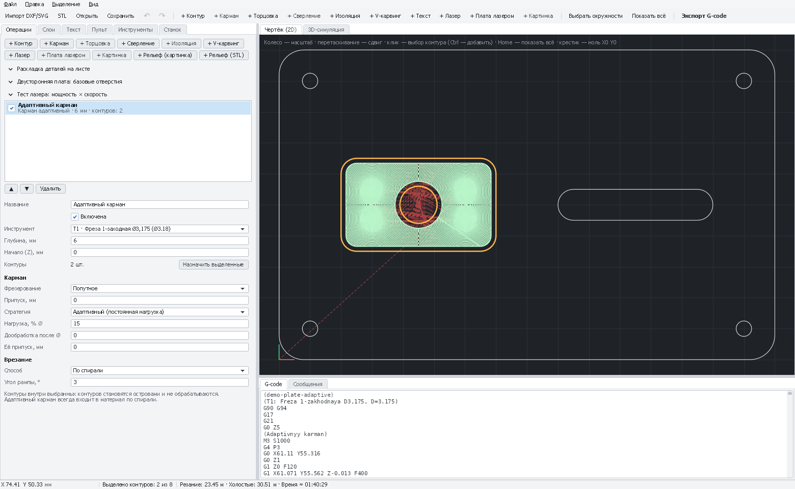

# Карман: выборка материала внутри контура

Фреза снимает весь материал внутри замкнутых контуров на заданную глубину. Контуры внутри выбранных становятся
**островами** — их фреза обходит. Три способа: обычный (кольцами), **адаптивный** (постоянная нагрузка) и
**дообработка** (меньшая фреза только там, где большая не достала).

*Карман «Кольцами» со спиральным врезанием: проходы идут эквидистантами внутрь контура.*

[← Все операции](README.md)

---

## Как добавить

1. Выделите наружный контур кармана **и** контуры островов внутри него (если есть).
2. **«+ Карман»**. Выберите инструмент и глубину.
3. Стратегия, нагрузка, дообработка — в разделе «Карман» панели операции.

## Поля

| Поле | Что значит | С чего начать |
|---|---|---|
| **Инструмент** | Концевая фреза. Чем крупнее — тем быстрее, но углы кармана будут скруглены радиусом фрезы | Ø3,175 |
| **Глубина, мм** | Глубина кармана от «Начала (Z)» | — |
| **Фрезерование** | Попутное (чище) или встречное | Попутное |
| **Припуск, мм** | Оставить на стенках и островах (черновая обработка перед чистовой) | 0 |
| **Стратегия** | **Кольцами** или **Адаптивный** — см. ниже | Кольцами |
| **Нагрузка, % Ø** | Только для адаптивного: ширина полосы за проход | 12–20 |
| **Дообработка после Ø** | Диаметр крупной фрезы, которая уже выбрала этот карман; 0 — выключено | 0 |
| **Её припуск, мм** | Припуск, который оставила крупная фреза | 0 |
| **Врезание** | Для обычного кармана — рампой, по спирали или вертикально. Адаптивный всегда входит по спирали | Рампой, 3° |

Перекрытие колец обычного кармана — поле «Перекрытие, % Ø» **инструмента** (40–50 % для дерева).

## Стратегии

### Кольцами (обычный)

Кольца от центра к стенке с шагом перекрытия инструмента, последним — чистовое кольцо вдоль стенки.
Быстро и просто, но в начале и **в углах фреза режет почти всей шириной** — на слабом шпинделе 775 и маленьких
фрезах это нагрузка и поломки. Подходит для мягких материалов и крупных фрез.

### Адаптивный (постоянная нагрузка)

1. Фреза входит **по спирали** в середине кармана.
2. **Трохоидами** (петлями, которые сдвигаются на маленький шаг) прорезает канал вдоль середины.
3. От канала **кольца расходятся** к стенкам с шагом «Нагрузка» — фреза всё время снимает одинаково узкую полосу,
   без погружения на всю ширину даже в углах. На изгибах шаг уменьшается автоматически, чтобы нагрузка не росла.
4. Последний проход — вдоль стенок и островов.

Плюсы для 3018: фрезы ломаются реже, **«Шаг по глубине» инструмента можно поднять в 2–3 раза** (например,
с 1 до 2,5 мм для Ø3,175 в фанере), подачу — на 20–50 %. Минус: путь длиннее, на маленьких карманах выигрыша нет.
Если карман лишь чуть шире фрезы, PathForge предупредит: такой карман всё равно режется полной шириной.

*Адаптивный карман: петли постоянной нагрузки вместо колец — фреза не зарывается в углы.*

### Дообработка

Крупная фреза быстро выбирает карман, но не достаёт в углы (остаётся скругление радиусом фрезы) и в узкие места.
Вторая операция «Карман» **на тех же контурах** с меньшей фрезой и полем **«Дообработка после Ø» = диаметр крупной**
проходит **только там, где остался материал**, а не весь контур заново.

Если крупная фреза оставляла припуск на стенках, впишите его в **«Её припуск»** — тогда мелкая пройдёт вдоль всех
стенок и снимет и его. Если мелкая не меньше крупной — PathForge предупредит.

## Пошагово: глубокий карман на 775-м

1. Инструменты: «Фреза 1-заходная Ø3,175» и «Фреза Ø1».
2. Выделите контур кармана → «+ Карман»: Ø3,175, глубина **8**, стратегия **Адаптивный**, нагрузка **15 %**.
   В инструменте Ø3,175 поставьте «Шаг по глубине» **2**.
3. Ещё раз «+ Карман» на тех же контурах: Ø1, глубина **8**, **«Дообработка после Ø» = 3,175** — дочистит углы.
4. «3D-симуляция»: убедитесь, что углы выбраны.

## Если что-то не так

| Признак | Что делать |
|---|---|
| «Фреза не помещается в карман» | Карман уже фрезы (с припуском) — возьмите фрезу меньше |
| В углах остались скругления | Так и должно быть: радиус фрезы. Дообработка меньшей фрезой |
| Остров срезан | Остров не был выделен вместе с карманом — выделите оба и «Назначить выделенные» |
| Визг и сколы в углах | Обычный карман в углах режет всей шириной — адаптивная стратегия или меньше подача |
| «Предыдущая фреза уже всё убрала» | Мелкой фрезе нечего доделывать: проверьте «Дообработка после Ø» |
