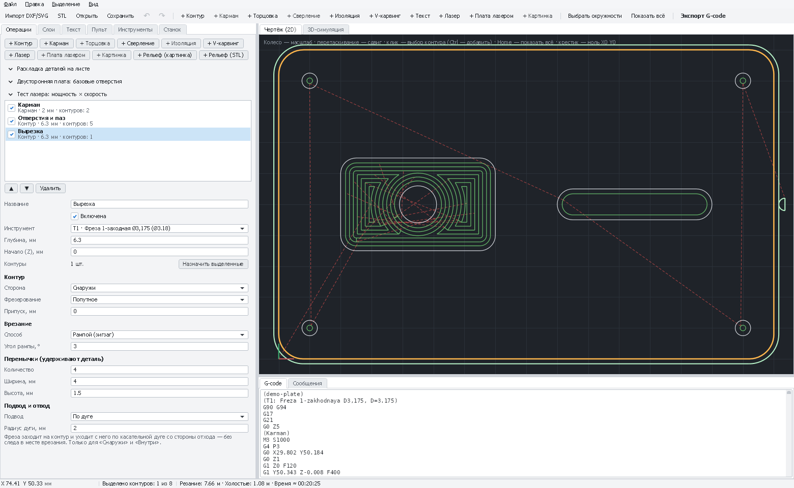

# Контур: вырезать деталь, отверстие, паз

Фреза идёт вдоль контура — снаружи (деталь в размер), внутри (отверстие в размер) или прямо по линии (гравировка,
разрез). Глубина набирается за несколько проходов по «Шагу по глубине» инструмента. Перемычки удерживают деталь,
чтобы она не сорвалась в конце.

*Демо-деталь: операция «Вырезка» — контур снаружи, четыре перемычки, заход по дуге. Справа траектории, внизу G-code.*

[← Все операции](README.md)

---

## Когда использовать

- Вырезать деталь из листа (фанера, МДФ, акрил, текстолит) — **«Снаружи»**.
- Вырезать отверстие или окно точно в размер — **«Внутри»**.
- Прорезать по линии, гравировать контур, вырезать паз шириной с фрезу — **«По линии»**.
- Паз (овальное отверстие) из сверловки платы — «Внутри»; если фреза шириной с паз — она пройдёт по его оси.

## Как добавить

1. Выделите контуры (клик, Ctrl+клик; «Слои» → «Выделить»).
2. **«+ Контур»** на панели инструментов или на вкладке «Операции».
3. Выберите инструмент, глубину, сторону — траектория появится на чертеже сразу.

## Поля

| Поле | Что значит | С чего начать |
|---|---|---|
| **Инструмент** | Концевая фреза («кукуруза», 1–2-заходная) | Ø3,175 для дерева, Ø1,0 для текстолита |
| **Глубина, мм** | Сквозной рез — толщина заготовки + 0,2–0,3 мм (в жертвенный лист) | 6,3 для фанеры 6 мм |
| **Сторона** | Снаружи / Внутри — фреза смещается на радиус, деталь или отверстие выходят в размер. По линии — центр фрезы на линии | — |
| **Фрезерование** | **Попутное** — чище край, меньше заусенцев (по умолчанию). **Встречное** — надёжнее на слабом станке и рыхлом материале | Попутное |
| **Припуск, мм** | Оставить материал на стенке (черновой проход, потом чистовой с припуском 0). Отрицательный — срезать глубже линии | 0 |
| **Перемычки: количество** | Сколько мостиков удержат деталь. Не режутся до дна | 3–4 для детали 100–200 мм |
| **Ширина, мм** | Ширина каждой перемычки (плюс диаметр фрезы) | 3–4 |
| **Высота, мм** | Высота перемычки над дном реза | 1–1,5 для фанеры 6 мм; 0,5–0,8 для текстолита |
| **Подвод** | **По дуге** — фреза заходит и уходит по касательной дуге со свободной стороны: нет следа в месте врезания. Только «Снаружи»/«Внутри» | Нет / По дуге для чистовых проходов |
| **Радиус дуги, мм** | Радиус дуги подвода; если не помещается (маленькое отверстие), уменьшается сам | 2 |
| **Врезание** | **Рампой** — зигзагом вдоль начала контура (бережно для 775). **По спирали** — непрерывными витками без вертикальных врезаний. **Вертикально** — сразу вниз | Рампой, угол 3° |
| **Дообработка по симуляции** | Резать только там, где фреза ещё встретит материал после операций выше по списку — см. ниже | Выкл. |
| **Допуск остатков, мм** | Остаток тоньше этого не трогать | 0,05 |

## Как это работает

- Глубина делится на проходы по «Шагу по глубине» инструмента: 6,3 мм шагом 1 мм — 7 проходов.
- Контуры, лежащие внутри других, режутся **раньше** наружных: деталь не освобождается, пока не вырезаны её отверстия.
- Незамкнутый контур режется только по линии (PathForge предупредит).
- При спиральном врезании и без перемычек каждый проход — один непрерывный опускающийся виток, в конце — ровный
  виток по дну.

## Дообработка по симуляции

С флажком **«Дообработка по симуляции»** PathForge прогоняет 3D-симуляцию фрезерных операций **выше по списку** и
на каждом проходе по глубине режет контур только там, где фреза ещё встретит материал. Когда это нужно:

- **черновой и чистовой проход**: первая операция — с припуском 0,3–0,5 мм, вторая (тот же контур, припуск 0,
  флажок) — снимет только припуск, а не будет заново проходить всю глубину по воздуху ступенями черновой;
- **догнать глубину**: контур уже прорезан на 4 мм, а нужно 6 — вторая операция с глубиной 6 и флажком пойдёт
  только на проходах ниже 4 мм;
- **узкие места**: крупная фреза не пролезла между деталями — мелкая пройдёт только там.

Перемычки сохраняются (над ними фреза идёт по верху перемычки). Подвод по дуге в этом режиме не используется:
фреза входит в начале каждого участка рампой или по спирали. Если выше нет фрезерных операций, контур режется
полностью (с предупреждением); если резать нечего — «остатков нет».

## Пошагово: вырезать деталь из фанеры 6 мм

1. «Станок» → «Толщина заготовки» **6**, ноль X/Y — **левый нижний угол**, Z — **верх заготовки**.
2. Инструмент: «Дерево, фанера: Фреза 1-заходная Ø3,175».
3. Отверстия: выделите → «+ Контур», **Внутри**, глубина **6,3**.
4. Наружный контур: выделите → «+ Контур», **Снаружи**, глубина **6,3**, перемычки **4 × 4 мм**, высота **1,2**.
5. Порядок ▲ ▼: отверстия, потом наружный контур.
6. «3D-симуляция» → ▶: проверьте, что перемычки на месте.
7. После резки — перережьте перемычки ножом, зачистите напильником.

## Если что-то не так

| Признак | Что делать |
|---|---|
| Деталь меньше/больше на диаметр фрезы | Не та сторона: «Снаружи» для детали, «Внутри» для отверстия. Проверьте диаметр фрезы в инструменте |
| Деталь сорвалась и «пожевалась» в конце | Перемычки: больше штук или выше; крепление заготовки |
| Ступеньки на стенке | Люфт или прогиб фрезы: попутное фрезерование, меньше шаг по глубине, чистовой проход с припуском 0 после черновой с 0,3 |
| Подгорает край (дерево, акрил) | Подача мала для оборотов — поднимите подачу на 10–20 % или уменьшите обороты |
| «Остатков нет» (дообработка по симуляции) | Операции выше уже прорезали контур; проверьте порядок операций и глубину |
| Отверстие меньше фрезы не вырезается | Фреза не помещается — PathForge не построит траекторию. Возьмите фрезу меньше или «Сверление» |
| «Подвод по дуге не помещается» | Отверстие маленькое: подвод выключится для этого контура сам |
