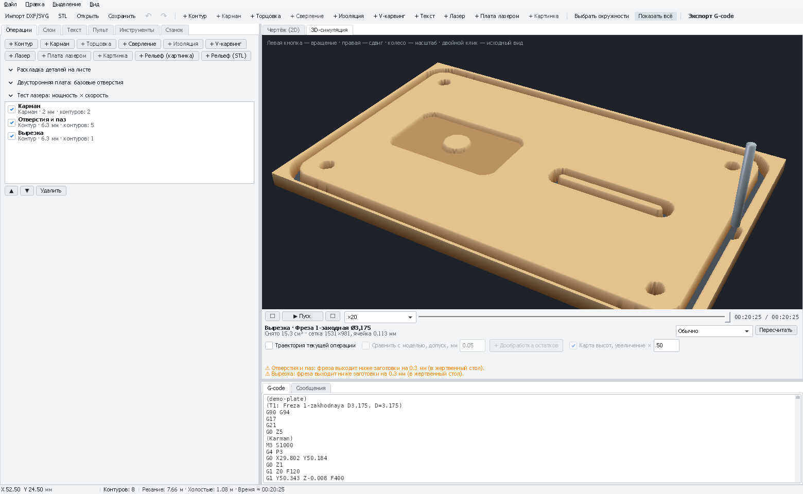
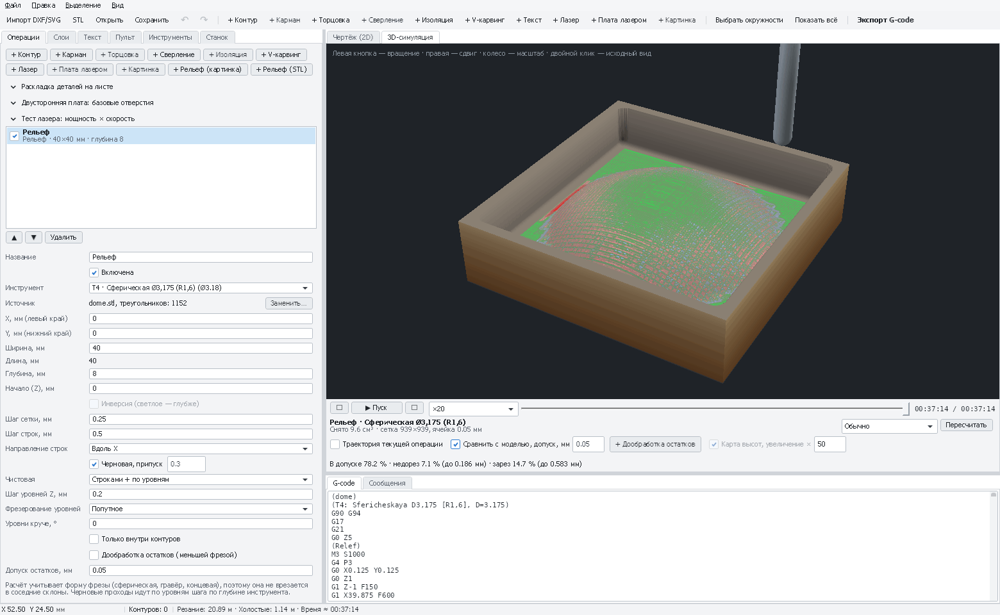

# 3D-симуляция и сравнение с моделью

Вкладка **«3D-симуляция»** показывает, как фреза снимает материал с заготовки: форма фрезы (концевая,
сферическая, V-образная, сверло), следы лазера, ошибки программы — до того, как станок испортит заготовку.

*3D-симуляция демо-детали: карман, отверстия, паз и вырезка с перемычками; внизу — проигрывание, скорость и время.*

[← Все операции](README.md)

---

## Как пользоваться

1. Откройте вкладку **«3D-симуляция»**. После изменений в проекте нажмите **«Пересчитать»**.
2. **▶** — воспроизведение, скорость ×1…×1000, ползунок — перемотка в любой момент.
3. Мышь: левая кнопка — вращение, правая — сдвиг, колесо — масштаб, двойной клик — исходный вид.
4. На вкладке **G-code** внизу подсвечена строка, которую сейчас проигрывает симуляция, — видно, какая команда
   режет то или иное место (перемотайте ползунком и посмотрите строку). Дуга `G2`/`G3` — одна строка на всю дугу.

Внизу — снятый объём и **предупреждения**:

- *холостой ход (G0) врезается в материал* — быстрый ход проходит сквозь заготовку: проверьте безопасную высоту на
  вкладке «Станок» и порядок операций;
- *фреза выходит ниже заготовки на … мм* — сквозной рез уходит в жертвенный стол (нормально на 0,2–0,5 мм; больше —
  проверьте глубину и толщину заготовки).

## Флажки

| Флажок | Что показывает |
|---|---|
| **Траектория текущей операции** | Голубые линии пути операции, которая выполняется: видно, куда фреза пойдёт дальше |
| **Сравнить с моделью, допуск** | Для рельефов 3D: заготовка раскрашена по отличию от модели. **Зелёный** — в допуске, **синий** — остался материал (недорез: фреза не достала или крупный шаг), **красный** — срезано лишнее (зарез). Внизу — проценты и максимумы |
| **+ Дообработка остатков** | Добавить операцию, которая меньшей фрезой снимет синие места — см. [Рельеф 3D](relief-3d.md#дообработка-остатков-меньшей-фрезой) |
| **Карта высот, увеличение ×** | Снятая щупом карта высот платы цветной поверхностью: синее ниже, красное выше; неровности растянуты по высоте |

*«Сравнить с моделью»: зелёное — в допуске, синее — остался материал, красное — срезано лишнее.*

## Советы

- Симулируйте **каждый** новый проект перед первым запуском — это бесплатно.
- Проверяйте перемычки контура: они должны остаться на детали.
- Сравнение с моделью доступно, только если в проекте есть рельеф 3D.
- Та же симуляция ищет остатки для дообработки: у [рельефа](relief-3d.md#дообработка-остатков-меньшей-фрезой),
  [кармана](pocket.md#дообработка-по-симуляции) и [контура](profile.md#дообработка-по-симуляции) (флажок
  «Дообработка по симуляции»).
- Точность симуляции — сетка 0,05–2 мм (подбирается под размер); мелкие детали видны при приближении.
