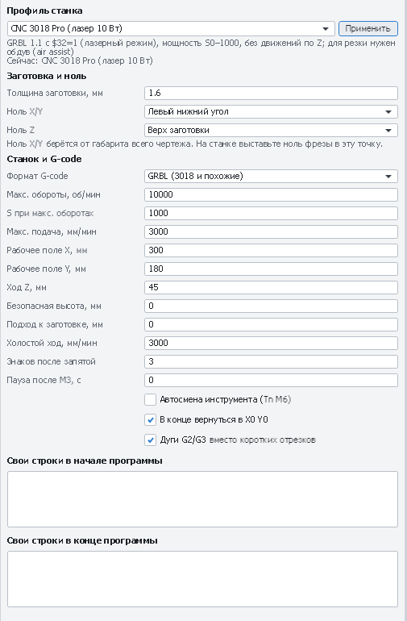
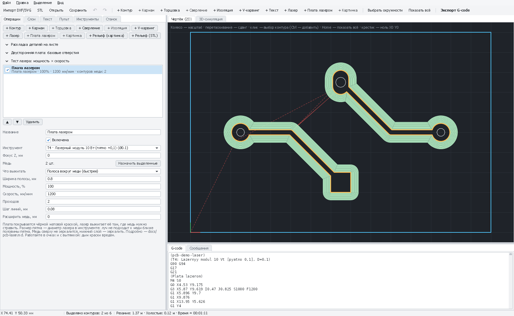

# Печатная плата лазером: краска + травление

Пошаговая инструкция для тех, кто делает плату этим способом впервые. Медь заготовки покрывается чёрной
матовой краской, лазер выжигает краску там, где медь должна исчезнуть (зазоры между дорожками), плата
тщательно промывается и травится в растворе. Краска защищает дорожки и площадки, а голая медь растворяется.

На первую плату уйдёт вечер (вместе с подбором режимов), на следующие — около часа, из которого большая часть —
ожидание: краска сохнет, лазер работает, раствор травит.

[← Назад к README](../README.md) · [Плата фрезеровкой](pcb-milling.md)

---

## Содержание

0. [Как это работает и чем отличается от фрезеровки](#0-как-это-работает-и-чем-отличается-от-фрезеровки)
1. [Безопасность](#1-безопасность)
2. [Что понадобится](#2-что-понадобится)
3. [Подготовка платы в САПР](#3-подготовка-платы-в-сапр)
4. [Подготовка и покраска заготовки](#4-подготовка-и-покраска-заготовки)
5. [Настройка станка и лазера](#5-настройка-станка-и-лазера)
6. [Подбор мощности и скорости тест-сеткой](#6-подбор-мощности-и-скорости-тест-сеткой)
7. [Проект в PathForge](#7-проект-в-pathforge)
8. [Выжигание](#8-выжигание)
9. [Промывка](#9-промывка)
10. [Травление](#10-травление)
11. [Снятие краски и защита меди](#11-снятие-краски-и-защита-меди)
12. [Сверление и обрезка платы](#12-сверление-и-обрезка-платы)
13. [Проблемы и решения](#13-проблемы-и-решения)
14. [Шпаргалка](#14-шпаргалка)

---

## 0. Как это работает и чем отличается от фрезеровки

```
 1. Покраска            2. Лазер выжигает        3. Промывка и           4. Краску смывают —
                           краску в зазорах         травление               остаются дорожки
 ███████████████        ███ ░░ ████ ░░ ███        ███    ████    ███       ▄▄▄    ▄▄▄▄    ▄▄▄
 ▓▓▓▓▓▓▓▓▓▓▓▓▓▓▓        ▓▓▓▓▓▓▓▓▓▓▓▓▓▓▓▓▓        ▓▓▓    ▓▓▓▓    ▓▓▓       ▓▓▓    ▓▓▓▓    ▓▓▓
 ───────────────        ─────────────────        ───────────────────       ───────────────────
 краска █, медь ▓,      ░ — краска снята,         медь без краски           медь, текстолит
 текстолит ─            медь открыта              растворилась
```

Лазер **не режет медь** — он только снимает тонкий слой краски. Диодному лазеру 5–10 Вт медь не по зубам,
а чёрную краску он испаряет легко. Дальше работает химия.

| | Лазер + травление (эта инструкция) | Фрезеровка гравёром ([инструкция](pcb-milling.md)) |
|---|---|---|
| Самые тонкие дорожки и зазоры | 0,2–0,25 мм (при хорошем фокусе) | 0,3–0,4 мм |
| Ровность платы | Не важна: лазер не касается платы | Очень важна: нужна карта высот |
| Шум, пыль стеклотекстолита | Нет | Есть (пыль вредна) |
| Расход инструмента | Нет | Гравёры ломаются и тупятся |
| Химия | Нужна (травильный раствор) | Не нужна |
| Убрать всю лишнюю медь | Легко (режим «Вся лишняя медь») | Долго (много проходов) |
| Время работы станка | Полоса: 5–15 мин, вся медь: 20–60 мин | 10–30 мин |

---

## 1. Безопасность

Прочитайте этот раздел до того, как включите лазер.

**Лазер**
- Луч диодного модуля 5–10 Вт **мгновенно и необратимо повреждает сетчатку**, в том числе отражённый
  от меди или металлического стола. Надевайте **очки под длину волны модуля** (обычно 445–455 нм,
  оптическая плотность OD 4+ или выше). Солнечные очки и «очки из комплекта», которые не указывают длину волны,
  не защищают. Очки должны быть на всех, кто находится в комнате.
- Не смотрите на пятно лазера без очков, даже на самой малой мощности.
- Не оставляйте работающий лазер без присмотра. Рядом — огнетушитель или хотя бы мокрая тряпка.
- Дым горящей краски ядовит. Работайте с **вытяжкой** (вентилятор в окно, короб над станком) или
  хотя бы при открытом окне, а лучше — под вытяжным зонтом.

**Химия**
- Травильные растворы едкие. **Резиновые перчатки и защитные очки** обязательны.
- Только пластиковая или стеклянная посуда. **Никакого металла** (кроме специально оговорённых случаев):
  раствор его съест.
- Работайте там, где пролитая капля ничего не испортит: хлорное железо оставляет несмываемые рыжие пятна.
- **Не сливайте отработанный раствор в канализацию**: в нём растворённая медь. Храните его в подписанной
  пластиковой бутылке и сдайте в пункт приёма опасных отходов (правила зависят от вашего региона).
- Растворители (ацетон, 646) легко воспламеняются — подальше от лазера и паяльника.

---

## 2. Что понадобится

**Станок и лазер**
- CNC 3018 Pro (или любой станок с GRBL) с **диодным лазерным модулем 5–10 Вт** (длина волны 445–455 нм).
  Модуль подключается к выходу шпинделя/лазера на плате (PWM). Как настроить плату MKS DLC32 —
  [в отдельной инструкции](mks-dlc32.md).
- Очки под длину волны лазера (см. выше).
- Вытяжка или вентилятор.

**Заготовка и краска**
- **Фольгированный стеклотекстолит FR-4**, односторонний, толщина 1–1,6 мм, медь 18 или 35 мкм
  (тонкая медь травится быстрее и ровнее).
- **Чёрная матовая аэрозольная краска** (акриловая или алкидная эмаль, например автомобильная грунтовка-эмаль
  или краска для дисков). Матовая лучше глянцевой: меньше отражает и лучше поглощает луч.
  Можно взять и чёрную термостойкую — она прочнее держится в растворе.
- Обезжириватель: изопропиловый спирт (IPA), уайт-спирит или ацетон.
- Мелкая наждачная бумага (P800–P1500) или абразивная губка, либо обычный канцелярский ластик.
- Бумажные полотенца без ворса, перчатки (чтобы не трогать медь пальцами).

**Травление и отделка**
- Травильный раствор — один из вариантов в [разделе 10](#10-травление): хлорное железо, персульфат аммония
  или перекись водорода с лимонной кислотой и солью.
- Пластиковая ванночка (контейнер для еды подойдёт — больше его для еды не используйте),
  пластиковый пинцет или кусок проволоки в изоляции, мягкая зубная щётка.
- Ацетон или растворитель 646 — снять краску после травления.
- Флюс (спиртоканифольный, ЛТИ-120 и т. п.) или сплав Розе/Вуда — залудить медь.

**Для сверления и обрезки** (если делаете их на станке)
- Шпиндель на 3018, свёрла 0,8 и 1,0 мм для плат, «кукуруза» Ø1,0 мм для вырезки — см.
  [инструкцию по фрезеровке](pcb-milling.md).

---

## 3. Подготовка платы в САПР

Плата рисуется как обычно (KiCad, Altium Designer, EasyEDA, Eagle), но с запасом по размерам —
домашнее травление всегда немного подъедает медь.

**Рекомендуемые правила (Design Rules)**

| Параметр | Для первой платы | Минимум при хорошем фокусе |
|---|---|---|
| Ширина дорожки | 0,4 мм | 0,25 мм |
| Зазор между медью | 0,4 мм | 0,2–0,25 мм (больше пятна лазера!) |
| Поясок площадки (медь вокруг отверстия) | 0,4 мм | 0,25 мм |
| Диаметр площадки под выводной элемент | 1,8–2,0 мм | 1,5 мм |

> **Зазор между медью должен быть больше пятна лазера** (0,1–0,15 мм) с запасом. Если зазор меньше пятна,
> луч туда просто не поместится — PathForge предупредит об этом.

**Полигоны (заливка медью).** Заливка «землёй» свободных мест уменьшает количество меди, которое нужно стравить:
раствор служит дольше, травление идёт быстрее и ровнее. Для лазерного способа это хорошая идея.

**Какие файлы нужны.** Выведите для производства (Fabrication Outputs / Plot):

| Что | KiCad | Altium Designer | Зачем |
|---|---|---|---|
| Медь сверху | `*-F_Cu.gbr` | `*.GTL` | Рисунок дорожек |
| Медь снизу (если плата односторонняя «снизу») | `*-B_Cu.gbr` | `*.GBL` | Рисунок дорожек |
| Контур платы | `*-Edge_Cuts.gbr` | `*.GKO` или `*.GM1` | Граница очистки, вырезка |
| Сверловка | `*.drl` | `*.TXT` | Метки для сверления, сверление |

Gerber и сверловку выводите **от одного и того же нуля** и в одних единицах — иначе отверстия сместятся.
Подробно про настройки Altium — в [README](../README.md#платы-из-altium-designer).

---

## 4. Подготовка и покраска заготовки

От качества покраски зависит половина успеха. Краска должна быть **тонкой, ровной и без пор**:
поры дадут точечные проколы в дорожках, толстый слой лазер не прожжёт за один проход.

1. **Отрежьте заготовку** на 10–20 мм больше платы с каждой стороны (запас на крепление и поля).
   Текстолит режут ножовкой по металлу, лобзиком или надрезают ножом по линейке с двух сторон и ломают.
   Пыль стеклотекстолита вредна — режьте над мокрой тряпкой или с пылесосом.
2. **Зачистите медь** мелкой наждачкой (P800–P1500) или абразивной губкой круговыми движениями,
   без нажима, до равномерного розового блеска. Подойдёт и обычный ластик. Цель — снять окислы и жир,
   а не процарапать медь.
3. **Обезжирьте**: протрите салфеткой с изопропиловым спиртом (или ацетоном) несколько раз, каждый раз
   чистой стороной. Дальше берите заготовку **только за края** и в перчатках: отпечаток пальца —
   это жир, на нём краска держится хуже.
4. **Покрасьте**:
   - взболтайте баллончик 1–2 минуты;
   - положите заготовку на лист картона медью вверх в проветриваемом месте без пыли;
   - распыляйте с 20–30 см, быстрыми движениями, начиная и заканчивая **за краем** заготовки;
   - сделайте **2–3 тонких слоя** с перерывом 5–10 минут. Первый слой может просвечивать — так и надо;
   - покрытие должно быть ровным, сплошным чёрным, без потёков и «шагрени».
5. **Высушите**: на ощупь краска сохнет за 20–30 минут, но для травления её лучше выдержать **несколько часов**
   (а ещё лучше — сутки) при комнатной температуре. Ускорить можно, прогрев 15–20 минут при 60–70 °C
   (духовка, которую не используете для еды, фен на расстоянии, батарея).
6. **Проверьте на просвет**: посмотрите на заготовку под углом при ярком свете. Видны блестящие точки меди —
   подкрасьте ещё одним тонким слоем.

> Покрасьте сразу 2–3 заготовки и один маленький обрезок — на нём вы подберёте режим лазера
> ([раздел 6](#6-подбор-мощности-и-скорости-тест-сеткой)).

---

## 5. Настройка станка и лазера

### 5.1. Профиль станка и GRBL

1. В PathForge откройте вкладку **«Станок»** → **«Профиль станка»** → **«CNC 3018 Pro (лазер 5 Вт)»**
   или **«CNC 3018 Pro (лазер 10 Вт)»** → **«Применить»**. Профиль включает лазерный режим: мощность
   S0–1000, без движений по Z, лазер гаснет на холостых ходах.
2. Подключитесь к станку (вкладка **«Пульт»** → порт → **«Подключить»**), в консоли наберите `$$` и проверьте:
   - `$32=1` — **лазерный режим** (на холостых ходах луч гаснет сам, мощность подстраивается под скорость
     в углах). Если `$32=0` — отправьте `$32=1`;
   - `$30=1000` — максимальное значение S. Если другое — отправьте `$30=1000`.

   > Когда снова поставите шпиндель, верните `$32=0`, иначе шпиндель будет останавливаться на каждом
   > холостом ходе.



*Профиль «CNC 3018 Pro (лазер 10 Вт)» на вкладке «Станок».*

### 5.2. Лазер в инструментах

1. Вкладка **«Инструменты»** → в списке пресетов **«Лазер: Лазерный модуль 5 Вт (пятно ≈0,15)»** или
   **«Лазер: Лазерный модуль 10 Вт (пятно ≈0,1)»** → **«Добавить»**.
2. **Диаметр** этого инструмента — это **размер пятна лазера**. PathForge держит центр луча на половину пятна
   от меди, чтобы край выжженной полосы пришёлся ровно на край дорожки. Поэтому диаметр должен быть
   **настоящим**: после фокусировки измерьте пятно (см. ниже) и впишите его.

### 5.3. Фокусировка

Лазер работает только тогда, когда пятно на краске **минимальное**. Расфокусированный луч широкий и слабый:
краска не снимается, а края дорожек получаются размытыми.

1. Положите на стол покрашенную заготовку или обрезок той же толщины.
2. Модули с **фиксированным фокусом** (часто 10 Вт) выставляются по высоте: в комплекте обычно есть
   мерная ножка или указано фокусное расстояние (например, «20 мм от низа модуля до поверхности») —
   опустите или поднимите модуль по Z до этого расстояния.
3. Модули с **регулируемой линзой**:
   - если у модуля есть кнопка или режим фокусировки (слабый постоянный луч) — включите его;
   - иначе: в консоли «Пульта» временно отправьте `$32=0`, затем `M3 S10` (1 % мощности — пятно светится,
     но не жжёт). **В очках!** Вращайте линзу (или двигайте модуль по Z), пока пятно не станет самой маленькой,
     чёткой точкой. Затем `M5` (выключить луч) и снова `$32=1`.
4. **Проверка и измерение пятна**: покажет только реальная линия. Подойдёт тест-сетка из следующего раздела:
   в режиме «Рез (контур)» лазер выжжет квадраты одной линией — измерьте ширину линии под лупой
   или штангенциркулем (или сравните с линейкой 0,5 мм под микроскопом). Типично 0,08–0,15 мм.
   Впишите это значение в **диаметр** лазерного инструмента.
5. После фокусировки **не трогайте Z** до конца работы. Лазерные операции PathForge по Z не двигаются
   («Фокус Z» = 0 означает «как сфокусировано сейчас»).

---

## 6. Подбор мощности и скорости тест-сеткой

Краски бывают разные, лазеры тоже: точный режим подбирают на покрашенном обрезке. Это 10 минут, которые
экономят испорченные платы.

1. Положите покрашенный обрезок (хотя бы 70×70 мм) на стол, закрепите скотчем по углам.
2. **Файл → Новый проект**, выберите профиль лазера и добавьте лазер в инструменты (разделы
   [5.1](#51-профиль-станка-и-grbl) и [5.2](#52-лазер-в-инструментах)). Вкладка **«Операции»** → раскройте **«Тест лазера: мощность × скорость»**:
   - **Мощность, %**: от **40** до **100**, **4** шага;
   - **Скорость, мм/мин**: от **600** до **2400**, **4** шага;
   - **Квадрат, мм**: **6**;
   - **«Рез (контур)»** — **выключено** (квадраты заливаются — это и есть снятие краски).
3. **«+ Тест-сетка лазера»** — справа от чертежа появятся квадраты с подписями мощности (ряды)
   и скорости (столбцы), каждый — отдельная операция.
4. Выставьте ноль X/Y в левый нижний угол обрезка ([раздел 8](#8-выжигание), шаги 3–4) и запустите.
5. **Промойте обрезок** ([раздел 9](#9-промывка)) и рассмотрите квадраты под лупой при хорошем свете:
   - **хорошо**: медь чистая, блестящая, розовая, без тёмного налёта и полосок;
   - **мало**: квадрат серый или коричневый, остались полоски краски между линиями;
   - **много**: края квадрата вздулись, краска вокруг оплавилась, текстолит под медью потемнел.
6. Выберите **самую большую скорость**, при которой квадрат чистый, и для запаса возьмите скорость
   на **10–20 % меньше**. Мощность обычно 80–100 %.
7. **Надёжнее всего** протравить сам обрезок ([раздел 10](#10-травление)): в «хороших» квадратах медь должна
   стравиться полностью и одновременно с остальными.

> Делайте тест в **отдельном проекте** (**Файл → Новый проект**), а не в проекте платы: контуры тест-сетки
> из чертежа не удаляются (слой «Laser test» можно только скрыть на вкладке «Слои»).

Ориентиры (проверьте на своей краске!):

| Лазер | Мощность | Скорость | Проходов |
|---|---|---|---|
| 5 Вт (оптических) | 90–100 % | 600–1200 мм/мин | 2 |
| 10 Вт (оптических) | 80–100 % | 1200–2500 мм/мин | 2 |


*Тест-сетка: подберите самый быстрый режим, который выжигает краску до меди.*

---

## 7. Проект в PathForge

### 7.1. Загрузка файлов платы

1. **Файл → Новый проект** (или начните с только что запущенной программы).
2. Вкладка **«Станок»** → профиль лазера → **«Применить»** (см. [5.1](#51-профиль-станка-и-grbl)).
   **«Ноль X/Y»** — **«Левый нижний угол»**.
3. Вкладка **«Инструменты»** → лазер с правильным диаметром (см. [5.2](#52-лазер-в-инструментах)).
4. **Файл → Печатная плата → «Добавить файлы платы (несколько сразу)…»** → выделите в папке сразу
   медь, контур платы и сверловку (маску, шелкографию и пасту можно тоже — они будут пропущены).
   PathForge сам разберётся, где что, и сообщит об этом на вкладке **«Сообщения»**.
   Для пробы есть демо-плата: [`samples/pcb-demo`](../samples/pcb-demo).

### 7.2. Зеркалить или нет

Лазер смотрит на плату **сверху**, на покрашенную медь.

| Медь | Зеркалить? |
|---|---|
| Верхний слой (`F_Cu`, `.GTL`) — медь сверху, как в САПР | **Нет** |
| Нижний слой (`B_Cu`, `.GBL`) — плата односторонняя, детали с другой стороны | **Да**: **Файл → Печатная плата → «Зеркалить по X (нижний слой)»** |

> Не путайте с лазерно-утюжной технологией (ЛУТ): там рисунок печатают на бумаге и переносят на медь
> лицом вниз, поэтому верхний слой зеркалят. Здесь рисунок наносится **прямо на медь** — как видно сверху.

### 7.3. Операция «Плата лазером»

1. Выделите всё, что нужно: **Ctrl+A** (все видимые контуры) или на вкладке **«Слои»** кнопками
   **«Выделить»** / **«+»** — слой меди, слой контура платы и (по желанию) слой отверстий.
2. Нажмите **«+ Плата лазером»** (на панели инструментов, на вкладке «Операции» или в меню
   **Файл → Печатная плата**).
   - Контуры со слоя контура платы (по имени файла: `Edge_Cuts`, `.GKO`, `.GM1`, `Outline`…) станут
     **контуром платы**, остальные — **медью**. В «Сообщениях» появится, сколько чего получилось.
   - **Отверстия** внутри площадок тоже станут «дырками» в меди: в центре каждой площадки вытравится
     маленькая точка — по ней удобно сверлить, сверло не уходит в сторону. Если точки не нужны — не выделяйте слой
     отверстий.
3. Настройте операцию (панель справа от списка операций):

| Поле | Что значит | С чего начать |
|---|---|---|
| **Инструмент** | Лазер; его диаметр = пятно | Лазерный модуль с измеренным пятном |
| **Фокус Z, мм** | Высота фокуса относительно Z0 | **0** — как сфокусировано |
| **Медь** | Контуры, над которыми краска останется. «Назначить выделенные» заменяет их | — |
| **Что выжигать** | **Полоса вокруг меди** — как изоляция фрезой: быстро, остальная медь остаётся. **Вся лишняя медь** — краска снимается со всей платы, кроме дорожек и площадок | Для первой платы — полоса |
| **Ширина полосы, мм** | Ширина выжигаемой полосы (зазора) вокруг меди | **0,6–1,0** |
| **Контур платы** | Только для «Вся лишняя медь»: внутри него снимается краска. «Назначить выделенный» — выделите контур на чертеже и нажмите. Без контура — прямоугольник вокруг меди | Контур платы |
| **Поля, мм** | Насколько ещё очистить за контуром платы | **1–2**; 0 — см. совет ниже |
| **Мощность, %** / **Скорость, мм/мин** | Из тест-сетки | 100 % / 1000–1500 |
| **Проходов** | Сколько раз выжечь всё заново | **2** |
| **Шаг линий, мм** | Расстояние между соседними линиями луча. Должно быть **меньше пятна** | **0,05–0,08** (≈ половина пятна) |
| **Угол штриховки, °** | Направление линий в режиме «Вся лишняя медь» | **0** (вдоль X) |
| **Крест-накрест** | Каждый второй проход поперёк первого: нет полосок краски | Включено |
| **Расширить медь, мм** | Плюс — дорожки шире, минус — уже. Раствор подъедает края на 0,02–0,05 мм | **0**, после первой платы — по результату |

**Полоса или вся медь?**

- **Полоса вокруг меди** (0,6–1 мм) — в 3–5 раз быстрее. Остальная медь остаётся «островами»: её меньше
  травить, раствор служит дольше. Островки не мешают, но паять рядом с ними надо аккуратнее.
- **Вся лишняя медь** — плата выглядит как заводская: только дорожки и площадки. Дольше работа лазера
  и травление, больше расход раствора.

> **Совет.** В режиме «Вся лишняя медь» с **полями 0** снаружи контура платы медь останется: после травления
> край платы будет виден как граница медной рамки — по ней удобно резать плату ножовкой или выставлять ноль
> для вырезки на станке.



*Операция «Плата лазером»: зелёное — выжигаемая краска вокруг дорожек и площадок (медь под ними останется).*

### 7.4. Проверка перед запуском

1. Вкладка **«Сообщения»**: предупреждения PathForge. Самые важные:
   - *«некоторые дорожки ближе друг к другу, чем пятно лазера»* — луч не пройдёт между ними, после травления
     они останутся соединены. Сфокусируйте лазер лучше (меньше пятно), уменьшите «Расширить медь»
     или увеличьте зазор в САПР;
   - *«шаг линий … больше пятна лазера»* — между линиями останутся полоски краски: уменьшите шаг.
2. **«Чертёж (2D)»**: траектория луча показана поверх меди. Луч не должен заходить на дорожки.
3. **«3D-симуляция»**: следы лазера на заготовке — видно, где краска будет снята.
4. Строка состояния внизу — **примерное время** работы. Для режима «Вся лишняя медь» на плате 50×50 мм
   при шаге 0,08 мм и 1200 мм/мин это около 30 минут на проход.
5. **Сохраните проект** (Ctrl+S).

---

## 8. Выжигание

1. **Закрепите заготовку** краской вверх: двусторонним скотчем по углам или прижимами **за пределами**
   рабочей зоны. Заготовка должна лежать ровно и не шевелиться.
   Удобно закрепить на столе **упор-уголок** (две рейки под 90°) и прижимать заготовку к нему:
   её потом можно будет поставить на то же место для сверления.
2. **Наденьте очки**, включите вытяжку. Подключитесь к станку («Пульт» → «Подключить»).
3. **Подведите лазер** кнопками перемещения (или с клавиатуры — кнопка «⌨ Клавиатура и джойстик»)
   к точке, которая будет **левым нижним углом платы**. Отступите от края заготовки 5–10 мм:
   в режиме «Вся лишняя медь» с полями лазер выйдет левее и ниже нуля на ширину полей.
   Чтобы видеть, где лазер, можно на мгновение включить слабый луч, как при фокусировке ([5.3](#53-фокусировка)).
4. Нажмите **«X0 Y0»** (вкладка «Пульт», раздел «Ноль заготовки»). Z0 для лазера не важен — фокус выставлен
   механически.
5. По желанию: **«Проверить ($C)»** — GRBL прочитает программу, станок не двигается. Ошибки появятся в консоли.
   **«⬚ Обвести рамку»** — лазер на 1 % обойдёт прямоугольник вокруг всего задания: видно, что плата с полями
   ложится на заготовку.
6. **▶ Старт**. Проследите за первыми линиями: дым должен идти, на краске — чёткие линии.
   Что-то не так — **❚❚ Пауза** или **■ Стоп**.
7. После окончания **не снимайте заготовку**. Рассмотрите её под лупой (снимите очки только когда лазер выключен!):
   если краска местами осталась — запустите программу ещё раз с тем же нулём (или добавьте проходов).
   Сдвинуть заготовку и вернуть её точно на место потом почти невозможно.

---

## 9. Промывка

После лазера в выжженных местах остаётся тонкая плёнка нагара. Она не видна, но **раствор через неё не травит**
или травит пятнами. Промывка — обязательный шаг, а не «по желанию».

1. Промойте плату под **тёплой водой** с каплей средства для мытья посуды, **мягкой зубной щёткой**,
   лёгкими движениями вдоль и поперёк. Не трите сильно — краска на дорожках должна остаться целой.
2. Посмотрите под лупой: открытая медь должна быть **светлой, блестящей, розовой**, без тёмной дымки.
3. Если дымка осталась — аккуратно протрите эти места ватным диском с **изопропиловым спиртом**
   (сначала проверьте на краю заготовки, что спирт не растворяет вашу краску) и промойте водой ещё раз.
4. Стряхните воду, промокните бумажным полотенцем и **не трогайте медь пальцами**. Травите сразу,
   пока медь не окислилась.

---

## 10. Травление

Подойдёт любой из обычных растворов — краска их выдерживает.

| Раствор | Рецепт | Температура | Время | Особенности |
|---|---|---|---|---|
| **Хлорное железо** (FeCl₃) | 1 часть порошка на 3 части тёплой воды (≈ 300 г/л) | 40–50 °C | 10–30 мин | Быстрое, многоразовое. Тёмный, плату в нём не видно. Пачкает всё |
| **Персульфат аммония** (или натрия) | 200–250 г на 1 л воды | 45–55 °C | 15–30 мин | Прозрачный — видно, как идёт травление (раствор голубеет). Нужен подогрев; готовьте свежий |
| **Перекись + лимонная кислота + соль** | 100 мл перекиси водорода 3 % + 30 г лимонной кислоты + 5 г соли | Комнатная | 20–60 мин | Всё из аптеки и магазина. Одноразовый, медленнее |

Порядок:

1. Перчатки и очки. Ванночка — пластиковая, на подстилке из бумаги.
2. Налейте раствор слоем 1–2 см. Подогрейте, если нужно: поставьте ванночку в другую, с горячей водой
   (не грейте раствор на плите!).
3. Опустите плату **медью вверх** (так видно процесс) или подвесьте медью вниз на нитке/проволоке в изоляции —
   медью вниз продукты травления опускаются на дно и травление идёт быстрее.
4. **Покачивайте ванночку** всё время или водите по меди мягкой кисточкой — свежий раствор у меди ускоряет
   и выравнивает травление.
5. Проверяйте каждые 2–3 минуты (пластиковым пинцетом). Сначала медь тускнеет, потом в открытых местах
   появляется текстолит. **Вынимайте сразу**, как вся открытая медь исчезла: передержка подтравливает
   дорожки с боков (они становятся тоньше).
6. Промойте плату водой и посмотрите на просвет: между дорожками не должно остаться медных перемычек и «волос».
   Если остались — ещё 1–2 минуты в растворе.

---

## 11. Снятие краски и защита меди

1. Снимите краску **ацетоном** или растворителем 646 (ватным диском, в перчатках, на улице или с вытяжкой),
   либо мелкой наждачкой. Медь под краской будет чистой и блестящей.
2. **Проверьте мультиметром** в режиме прозвонки: соседние дорожки не должны звониться между собой.
   Медные «волоски» между ними срезайте скальпелем.
3. **Защитите медь** сразу — она быстро окисляется:
   - покройте спиртоканифольным флюсом (тонкий слой, высохнет — останется защитная плёнка), или
   - залудите паяльником с флюсом, или сплавом Розе/Вуда в горячей воде (только с опытом и вытяжкой).

---

## 12. Сверление и обрезка платы

### Вручную

Если при создании операции вы выделили и отверстия, в центре каждой площадки — вытравленная точка.
Сверлите по ней мини-дрелью на стойке (сверлильном станке): сверло само «садится» в ямку.
Свёрла для выводных деталей: 0,8 мм (резисторы, микросхемы), 1,0 мм (разъёмы, крупные выводы).

Плату обрезают ножовкой по металлу, лобзиком по металлу или надрезают с двух сторон и ломают,
края шлифуют наждачкой. Делайте это **над мокрой тряпкой** или с пылесосом — пыль стеклотекстолита вредна.

### На станке

Сверлить и вырезать плату на том же станке точнее, но нужно совместить ноль с вытравленным рисунком.

1. Поставьте шпиндель вместо лазера, верните `$32=0`, вкладка «Станок» → профиль
   **«CNC 3018 Pro (шпиндель 775)»** → «Применить».
2. В том же проекте добавьте операции сверления и вырезки (подробно — в
   [инструкции по фрезеровке, раздел 6](pcb-milling.md#6-проект-в-pathforge)), а операцию «Плата лазером»
   **выключите** (снимите галочку в списке операций).
3. Закрепите плату на столе медью вверх (если был упор-уголок — к нему).
4. **Совместите ноль по отверстию**:
   - на вкладке «Чертёж (2D)» увеличьте колесом мыши отверстие ближе к левому нижнему углу и наведите курсор
     точно на его центр. В строке состояния внизу видны его координаты, например `X 5,08 Y 3,81 мм`;
   - вставьте сверло, подведите его кнопками перемещения точно к вытравленной точке этого отверстия
     (опустите почти до касания и смотрите сбоку и спереди);
   - в консоли «Пульта» отправьте `G10 L20 P1 X5.08 Y3.81` (ваши числа, через точку). Это значит:
     «текущее положение — это X 5,08 Y 3,81»;
   - проверьте второе отверстие подальше от первого: отправьте `G0 X… Y…` с его координатами
     (сначала поднимите сверло!) и убедитесь, что сверло точно над его точкой. Если промахивается —
     плата повёрнута: выровняйте её и повторите.
5. Z0 — на поверхности меди: щупом (зажим на сверло, второй провод на медь, толщина пластины 0) или по
   бумажке. Дальше — как в [инструкции по фрезеровке](pcb-milling.md#7-на-станке).

---

## 13. Проблемы и решения

| Что видно | Почему | Что сделать |
|---|---|---|
| После лазера медь в выжженных местах тёмная, не блестит | Мало энергии или плохой фокус | Сфокусируйте лазер. Уменьшите скорость или поднимите мощность. Добавьте проход. Красьте тоньше |
| Полоски краски между линиями | Шаг линий больше пятна | Уменьшите «Шаг линий» (0,05–0,06), включите «Крест-накрест» |
| Медь травится пятнами, местами не травится | Нагар или жир на открытой меди | Промойте лучше ([раздел 9](#9-промывка)), спиртом. Не трогайте медь пальцами |
| Соседние дорожки соединились | Краска осталась в зазоре: зазор меньше пятна, недожгли или недотравили | Смотрите предупреждения PathForge. Больше зазор в САПР, лучше фокус, дольше травить |
| Дорожки тоньше, чем в САПР | Пятно больше, чем указано в инструменте; передержали в растворе | Измерьте пятно и впишите диаметр лазера. «Расширить медь» +0,02…0,05. Вынимайте плату вовремя |
| Дорожки толще, зазоры уже | Пятно меньше, чем указано | Уменьшите диаметр лазера в инструменте или «Расширить медь» в минус |
| Проколы и дырки в дорожках | Поры в краске, пыль при покраске, краска слишком тонкая | Ещё один слой краски, красьте в чистом месте. Мелкие дырки — заделайте припоем |
| Краска на дорожках вздулась или облезла в растворе | Краска не высохла, плохо обезжирили, перегрели | Сушите дольше, лучше зачищайте и обезжиривайте, не перегревайте раствор |
| Края дорожек «рваные», в зубчиках | Мало энергии на краях, вибрации | В режиме «Вся лишняя медь» обводка вдоль меди уже есть — добавьте проход. Проверьте натяжение ремней/люфты |
| Рисунок съехал посередине работы | Пропуск шагов | Уменьшите скорость; проверьте муфты, ремни, ускорения (`$120`, `$121`) |
| Лазер не включается | `$32`, `$30`, проводка, профиль | Профиль лазера в PathForge, `$32=1`, `$30=1000`; проверьте модуль кнопкой теста |
| Отверстие не по центру площадки | Gerber и сверловка выведены от разных нулей | В САПР выведите сверловку от того же нуля (см. [README](../README.md#платы-из-altium-designer)) |

---

## 14. Шпаргалка

1. САПР: дорожки ≥ 0,3–0,4 мм, зазоры ≥ 0,3 мм. Вывести медь, контур, сверловку (один ноль).
2. Заготовка: зачистить, обезжирить, 2–3 тонких слоя чёрной матовой краски, высушить.
3. «Станок» → профиль лазера → «Применить». GRBL: `$32=1`, `$30=1000`.
4. «Инструменты» → пресет лазера, **диаметр = измеренное пятно**. Сфокусировать.
5. Тест-сетка на покрашенном обрезке → лучшая скорость −10–20 %.
6. «Файл → Печатная плата → Добавить файлы платы». Нижний слой — «Зеркалить по X», верхний — нет.
7. Ctrl+A → **«+ Плата лазером»**: полоса 0,6–1 мм или вся медь; 2 прохода; шаг 0,06–0,08; крест-накрест.
8. Проверить «Сообщения», 2D и 3D. Сохранить.
9. Очки, вытяжка. Ноль X0 Y0 в углу платы → «▶ Старт». Не снимать заготовку до проверки.
10. Промыть (вода + средство + щётка, при необходимости спирт).
11. Травить, покачивая; вынуть сразу, как стравилась открытая медь.
12. Смыть краску ацетоном, прозвонить, покрыть флюсом/залудить. Сверлить по точкам, обрезать.
