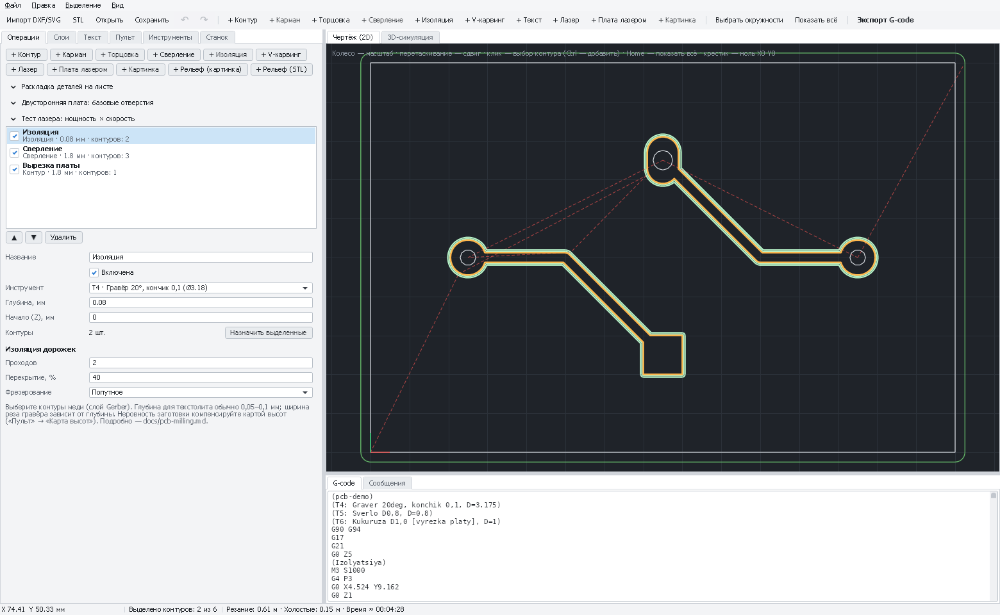
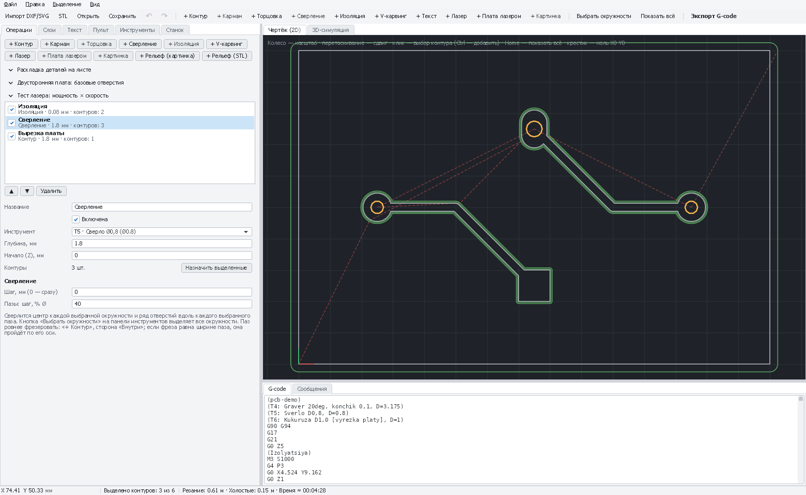
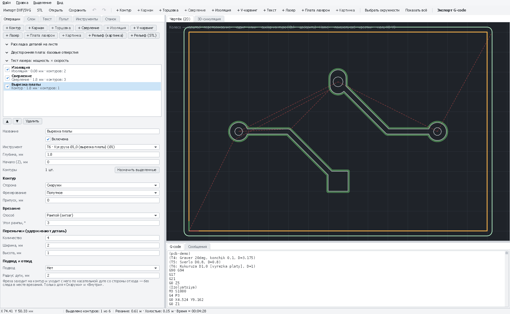
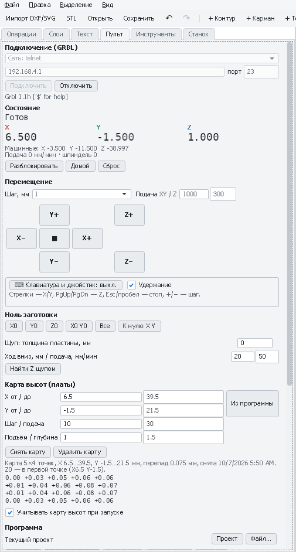
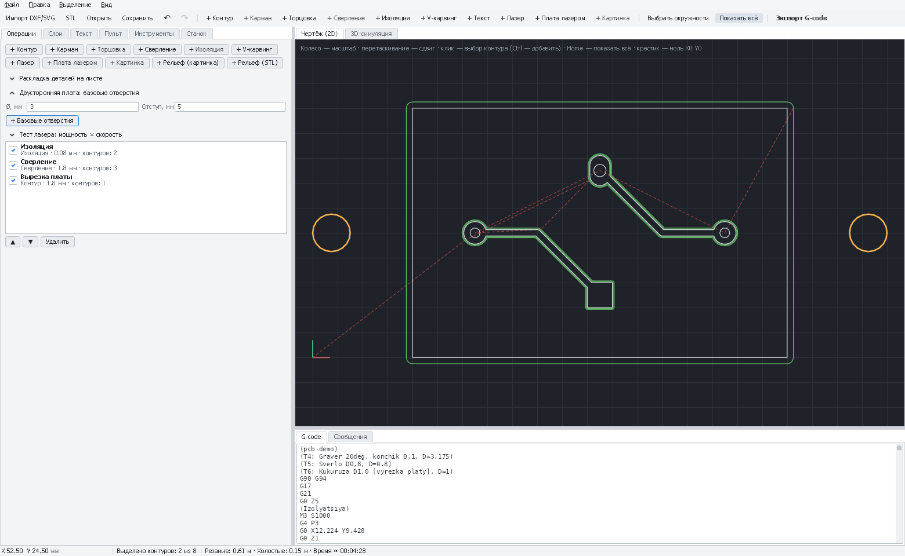

# Печатная плата фрезеровкой (изоляция дорожек)

Пошаговая инструкция для тех, кто фрезерует плату впервые. Гравёр (V-образная фреза с очень тонким кончиком)
прорезает в меди узкие канавки вокруг каждой дорожки и площадки — медь разделяется на изолированные
участки. Химии нет: после станка плату остаётся почистить, просверлить и вырезать (всё это делает тот же станок).

На первую плату уйдёт 2–3 часа вместе с подготовкой. Не пропускайте шаги: почти все неудачи (медь прорезана
не везде, сломан гравёр, отверстия мимо площадок) ловятся на них заранее.

[← Назад к README](../README.md) · [Плата лазером и травлением](pcb-laser.md) ·
[Первый запуск CNC 3018](first-run-3018.md)

---

## Содержание

0. [Как это работает](#0-как-это-работает)
1. [Безопасность](#1-безопасность)
2. [Что понадобится](#2-что-понадобится)
3. [Гравёр: ширина реза и глубина](#3-гравёр-ширина-реза-и-глубина)
4. [Подготовка платы в САПР](#4-подготовка-платы-в-сапр)
5. [Заготовка и крепление](#5-заготовка-и-крепление)
6. [Проект в PathForge](#6-проект-в-pathforge)
7. [На станке](#7-на-станке)
8. [После станка](#8-после-станка)
9. [Двусторонняя плата](#9-двусторонняя-плата)
10. [Проблемы и решения](#10-проблемы-и-решения)
11. [Шпаргалка](#11-шпаргалка)

---

## 0. Как это работает

```
 Вид сверху:                                    Разрез по линии A–A:

   ┌─────────────────────────────┐                  гравёр
   │ ░░░░░░░░░░░░░░░░░░░░░░░░░░░ │                    ▼
   │ ░┌───────────────────────┐░ │              ▓▓▓▓▓ \/ ▓▓▓▓▓▓▓ \/ ▓▓▓▓
 A │ ░│     дорожка (медь)    │░ │ A            ───────────────────────────
   │ ░└───────────────────────┘░ │                    канавки в меди
   │ ░░░░░░░░░░░░░░░░░░░░░░░░░░░ │              ▓ — медь, ─ — текстолит
   └─────────────────────────────┘
   ░ — канавка (изоляция), остальное — медь
```

Канавка проходит **сквозь медь** (18–35 мкм) и чуть-чуть заходит в текстолит. Глубина реза — десятые
и сотые доли миллиметра, поэтому всё решает **ровность**: на 0,05 мм выше — медь не прорезана,
на 0,05 мм ниже — канавка слишком широкая и съедает тонкую дорожку. PathForge умеет измерять неровность платы
щупом и повторять её при работе (**карта высот**) — это главный секрет удачной платы.

Медь, не касающаяся дорожек, остаётся на плате «островами» — это нормально и ничему не мешает.

| Плюсы | Минусы |
|---|---|
| Нет химии, всё на одном станке | Шумно, пыль стеклотекстолита |
| Сверление и вырезка без перестановки платы | Гравёры тупятся и ломаются |
| Повторяемо: один раз настроил — дальше по кнопке | Самые тонкие зазоры — около 0,3 мм |

---

## 1. Безопасность

- **Очки** — всегда: тонкие гравёры и свёрла ломаются, осколки летят.
- **Пыль стеклотекстолита вредна** для лёгких и раздражает кожу. Убирайте её **пылесосом**, а не сдувайте.
  Хорошо — пылесос со шлангом у фрезы во время работы, или кисточка, смоченная водой. При долгой работе —
  респиратор.
- Длинные волосы собраны, рукава закатаны, без перчаток рядом с вращающейся фрезой.
- Руку держите рядом с аварийной кнопкой или выключателем, станок без присмотра не оставляйте.
- Зажим щупа снимайте перед включением шпинделя: провод намотается на цангу.

---

## 2. Что понадобится

**Станок**
- CNC 3018 Pro со шпинделем 775 (или 500 Вт) и платой GRBL. Если станок новый — сначала пройдите
  [проверку и первый запуск](first-run-3018.md): оси, калибровка шагов, люфты. Люфт 0,1 мм на плате
  виден сразу.
- **Щуп** (обычно в комплекте 3018: провод с зажимом «крокодил» и провод к пластине). Для плат пластина не нужна:
  второй провод цепляют прямо к меди платы.
- Жертвенный стол: лист МДФ или фанеры 6–10 мм, привинченный к алюминиевому столу.

**Инструмент** (хвостовик 3,175 мм — под цангу ER11 3018)

| Инструмент | Для чего | Пресет PathForge |
|---|---|---|
| **Гравёр 20° или 30°, кончик 0,1 мм** (возьмите 5–10 шт., это расходник) | Изоляция дорожек | «Текстолит (платы): Гравёр 20°, кончик 0,1» / «…30°…» |
| **Сверло 0,8 мм** (твердосплавное, для плат) | Отверстия под резисторы, микросхемы | «Текстолит (платы): Сверло Ø0,8» |
| **Сверло 1,0 мм** | Разъёмы, крупные выводы | «Текстолит (платы): Сверло Ø1,0» |
| **«Кукуруза» Ø1,0 мм** (фреза для стеклотекстолита) | Вырезка платы, большие отверстия | «Текстолит (платы): Кукуруза Ø1,0 (вырезка платы)» |
| Свёрла 0,6 и 1,2 мм (по желанию) | Переходные отверстия, толстые выводы | «Текстолит (платы): Сверло Ø0,6» / «…Ø1,2» |
| Концевая фреза Ø2 мм (по желанию) | Удаление всей лишней меди | «Текстолит (платы): Фреза Ø2 (удаление лишней меди)» |

> Твердосплавные свёрла и гравёры очень хрупкие: не роняйте, не трогайте кончик, вставляйте в цангу аккуратно.
> Ломаются от бокового усилия — от удара о плату при быстром опускании, от перекоса, от слишком большой подачи.

**Заготовка и мелочи**
- **Фольгированный стеклотекстолит FR-4**, 1,5–1,6 мм, медь 18 или 35 мкм.
- **Двусторонний скотч**, тонкий и прочный (лучше тканевый или монтажный тонкий; толстый вспененный пружинит).
- Мелкая наждачка (P800–P1500), изопропиловый спирт, бумажные салфетки.
- Мультиметр с прозвонкой.
- Флюс (спиртоканифольный) или средство для лужения — защитить медь после станка.

---

## 3. Гравёр: ширина реза и глубина

У V-образного гравёра ширина канавки зависит от глубины:

```
ширина = кончик + 2 × глубина × tg(угол / 2)
```

| Гравёр | Глубина 0,05 мм | 0,08 мм | 0,10 мм | 0,15 мм |
|---|---|---|---|---|
| 20°, кончик 0,1 | 0,118 мм | 0,128 мм | 0,135 мм | 0,153 мм |
| 30°, кончик 0,1 | 0,127 мм | 0,143 мм | 0,154 мм | 0,180 мм |

PathForge считает это сам: в операции «Изоляция» ширина реза берётся из гравёра и глубины.

**Какую глубину ставить.** Медь 35 мкм = 0,035 мм. Глубину берут с запасом на неровность: **0,08–0,1 мм**.
С картой высот можно 0,06–0,08 мм (уже канавка — тоньше можно делать зазоры). Без карты высот на неровной плате
даже 0,15 мм может местами не прорезать медь.

**Сколько проходов.** Один проход — канавка шириной 0,13 мм: изоляция есть, но паять страшно, капля припоя
легко перемкнёт дорожки. **2–3 прохода** с перекрытием 40 % расширяют зазор до 0,2–0,3 мм —
паять гораздо спокойнее.

---

## 4. Подготовка платы в САПР

**Правила (Design Rules)** — с запасом для домашнего станка:

| Параметр | Для первой платы | Минимум |
|---|---|---|
| Ширина дорожки | 0,4–0,5 мм | 0,3 мм |
| Зазор между медью | 0,4 мм | 0,25 мм (больше ширины реза гравёра!) |
| Поясок площадки (медь вокруг отверстия) | 0,5 мм | 0,3 мм |
| Диаметр площадки под выводной элемент | 2,0 мм | 1,6 мм |

> **Зазор должен быть больше ширины реза гравёра** (≈ 0,13 мм) с хорошим запасом, иначе гравёр не пройдёт
> между дорожками. PathForge предупредит: *«некоторые дорожки ближе друг к другу, чем ширина реза»*.

**Выведите файлы для производства**:

| Что | KiCad (File → Plot / Fabrication Outputs) | Altium Designer | Кнопка в PathForge |
|---|---|---|---|
| Медь сверху / снизу | `*-F_Cu.gbr` / `*-B_Cu.gbr` | `*.GTL` / `*.GBL` | «Добавить Gerber: медь» |
| Контур платы | `*-Edge_Cuts.gbr` | `*.GKO` или `*.GM1` | «Добавить Gerber: контур платы» |
| Сверловка | `*.drl` (Excellon) | `*.TXT` (NC Drill) | «Добавить сверловку» |

Все файлы можно добавить **одной командой** — «Добавить файлы платы (несколько сразу)»: PathForge сам определит,
что есть что. Главное — Gerber и сверловка должны быть выведены **от одного нуля** (в KiCad — одинаковый
*Use drill/place file origin* в обоих окнах, в Altium — одинаковая настройка *Reference to relative origin*),
иначе отверстия сместятся относительно площадок. Подробно про Altium — в
[README](../README.md#платы-из-altium-designer).

---

## 5. Заготовка и крепление

1. **Выровняйте жертвенный стол** (один раз, потом пользуйтесь годами). Плата должна лежать параллельно
   движению фрезы. Лучший способ — **профрезеровать площадку** на жертвенном столе прямо на станке: новый проект →
   **«+ Торцовка»** → «Всё поле станка» (или прямоугольник чуть больше будущих плат), фреза «Ø6 для выравнивания
   стола» (или Ø3,175), глубина 0,3–0,5 мм. После этого площадка идеально параллельна осям X/Y.
2. **Отрежьте заготовку** на 5–10 мм больше платы с каждой стороны. Режьте над мокрой тряпкой или с пылесосом.
3. **Зачистите медь** мелкой наждачкой без нажима и **обезжирьте** спиртом. Чистая медь нужна и для резания,
   и для щупа: окисленная медь плохо проводит, щуп может сработать поздно.
4. **Приклейте заготовку** на двусторонний скотч: полосы скотча **по всей площади** (не только по углам),
   без нахлёстов — скотч в два слоя тоже неровность. Прижмите всю заготовку через тряпку или ровный брусок
   на 10–20 секунд. Заготовка не должна пружинить ни в одной точке.
5. Если удобно — добавьте прижимы по краям, **вне** зоны работы и подальше от пути шпинделя.

---

## 6. Проект в PathForge

### 6.1. Станок, заготовка, инструменты

1. **Файл → Новый проект**. Новый проект уже настроен на 3018 Pro со шпинделем 775. Если у вас шпиндель
   500 Вт — вкладка **«Станок»** → профиль **«CNC 3018 Pro (шпиндель 500 Вт)»** → **«Применить»**.
2. Вкладка **«Станок»** → **«Заготовка и ноль»**:
   - **Толщина заготовки, мм**: толщина платы, например **1,5** (измерьте штангенциркулем);
   - **Ноль X/Y**: **«Левый нижний угол»**;
   - **Ноль Z**: **«Верх заготовки»**.
3. Вкладка **«Инструменты»** → список пресетов → по очереди **«Добавить»**:
   - «Текстолит (платы): Гравёр 20°, кончик 0,1» (или 30°, смотря какой у вас);
   - «Текстолит (платы): Сверло Ø0,8» и (если нужно) «Сверло Ø1,0»;
   - «Текстолит (платы): Кукуруза Ø1,0 (вырезка платы)».

   Подачи в пресетах осторожные: гравёр 150 мм/мин, врезание 50 мм/мин. Не поднимайте их на первой плате.

### 6.2. Файлы платы

1. **Файл → Печатная плата → «Добавить файлы платы (несколько сразу)…»** → выделите медь, контур и сверловку.
   На вкладке **«Сообщения»** будет видно, какой файл чем распознан. Каждый файл становится слоем
   (вкладка **«Слои»**). Для пробы есть демо-плата: [`samples/pcb-demo`](../samples/pcb-demo) (KiCad)
   и [`samples/pcb-altium`](../samples/pcb-altium) (Altium).
2. **Зеркалить или нет.** Станок смотрит на плату сверху.

   | Медь | Зеркалить? |
   |---|---|
   | Верхний слой (`F_Cu`, `.GTL`) | **Нет** |
   | Нижний слой (`B_Cu`, `.GBL`) — односторонняя плата с деталями сверху | **Да**: **Файл → Печатная плата → «Зеркалить по X (нижний слой)»** |

   Если в Gerber есть атрибуты X2 (KiCad, новые Altium), PathForge сам напомнит, что нижний слой надо зеркалить.

### 6.3. Изоляция

1. Вкладка **«Слои»** → у слоя меди нажмите **«Выделить»** (или выделите контуры меди мышью: клик,
   Ctrl+клик — добавить).
2. **«+ Изоляция»**. Операция получит выделенную медь и гравёр.
3. Настройки:

   | Поле | Что значит | Значение |
   |---|---|---|
   | **Инструмент** | Гравёр | Гравёр 20° (или 30°) |
   | **Глубина, мм** | Насколько ниже поверхности меди | **0,08–0,1** (с картой высот 0,06–0,08) |
   | **Проходов** | Сколько канавок рядом: шире зазор | **2–3** |
   | **Перекрытие, %** | Насколько соседние канавки заходят друг на друга | **40** |
   | **Фрезерование** | Попутное или встречное | **Попутное** (чище край меди) |

4. Посмотрите на вкладку **«Сообщения»**. *«Некоторые дорожки ближе друг к другу, чем ширина реза»* —
   гравёр между ними не пройдёт. Решения: меньше глубина, гравёр с меньшим углом (20° вместо 30°),
   или увеличить зазор в САПР.



*Изоляция гравёром 20°: проходы вокруг дорожек и площадок.*

#### Удаление лишней меди фрезой (по желанию)

Изоляция оставляет вокруг дорожек узкие канавки, остальная медь остаётся. Если нужна плата «как с завода» —
только дорожки и площадки, без лишней меди (её легче паять, меньше риск замыкания) — медь можно снять фрезой.
Гравёром это слишком долго, поэтому работают два инструмента: **гравёр** аккуратно обходит дорожки (изоляция),
**концевая фреза Ø1–2 мм** кольцами снимает всё остальное.

1. Выделите медь **и контур платы** (слои меди и `Edge_Cuts` / `.GKO` на вкладке «Слои») → **«+ Удаление меди»**
   (или **Файл → Печатная плата → «+ Удаление лишней меди фрезой»**).
2. PathForge возьмёт самую крупную концевую фрезу до Ø3,2 (пресет «Текстолит (платы): Фреза Ø2 (удаление лишней
   меди)») и добавит операцию **«Удаление меди»**. Если изоляции этой меди ещё нет, она добавится тоже — с гравёром.
3. Поля операции:

   | Поле | Что значит | Значение |
   |---|---|---|
   | **Глубина, мм** | Как у изоляции | 0,08–0,1 |
   | **Контур платы** | Медь снимается внутри него (плюс поля). Без контура — прямоугольник вокруг меди | Слой контура платы |
   | **Поля, мм** | Насколько очищать за контуром | 1–2 |
   | **Не ближе к меди, мм** | Край фрезы не подходит к дорожкам ближе: эту полосу прорезает изоляция. Ставится сам — ширина изоляции минус 0,05 мм | Не трогать |

4. В узких местах между дорожками, куда фреза не пролезает, останутся **островки меди** — PathForge напишет их
   площадь. Они отделены от дорожек изоляцией и ничему не мешают; убрать и их — фреза меньше или больше проходов
   изоляции.
5. Порядок: изоляция → удаление меди → сверление → вырезка. Карта высот обязательна: фреза Ø2 на неровной плате
   либо не достанет до меди, либо уйдёт в текстолит.

### 6.4. Сверление

**Быстро — сверловка по диаметрам.** Добавьте в инструменты свёрла, которые у вас есть (пресеты «Текстолит
(платы): Сверло Ø0,6 / Ø0,8 / Ø1,0 / Ø1,2»), и нажмите **«+ Сверловка по Ø»** (или **Файл → Печатная плата →
«+ Сверловка по диаметрам»**). Без выделения берутся все слои сверловки (`Сверловка Ø…`, `Пазы Ø…`), с
выделением — только выделенные отверстия. PathForge:

- сгруппирует отверстия по диаметру и каждой группе подберёт **ближайшее сверло** (из двух одинаково близких —
  большее: вывод детали всё равно войдёт); в «Сообщениях» видно, какое сверло что сверлит;
- предупредит, если сверло отличается от отверстия больше чем на 0,1 мм — добавьте сверло нужного размера;
- пропустит отверстия больше самого толстого сверла на 0,5 мм и больше — их фрезеруйте (п. 4 ниже);
- создаст по операции на сверло, **от тонкого к толстому**, с глубиной существующей операции сверления (или
  толщина платы + 0,4 мм). Между ними программа остановится (`M0`) для смены сверла.

**Вручную:**

1. Выделите одно отверстие нужного диаметра → меню **«Выделение» → «Выделить отверстия того же диаметра»**.
   Отверстия из сверловки лежат на слоях по диаметрам — можно выделить и весь такой слой на вкладке «Слои».
2. **«+ Сверление»** → инструмент **«Сверло Ø0,8»** (или ближайшее по диаметру).
3. **Глубина, мм** = толщина платы + 0,2, например **1,7**. **Шаг, мм** — **0** (тонкая плата сверлится сразу)
   или 0,5–0,8, если свёрла забиваются.
4. Повторите для других диаметров. Отверстия больше 1,2 мм удобнее фрезеровать: выделите их → **«+ Контур»**,
   сторона **«Внутри»**, «кукуруза» Ø1,0, глубина как у сверления.
5. **Пазы** (овальные отверстия, `G85` в сверловке, слой «Пазы Ø…») тоже можно выделить для «+ Сверление»: паз
   сверлится рядом отверстий вдоль оси (поле **«Пазы: шаг, % Ø»**, 30–50 %), сначала через одно — сверло не уводит
   в соседнее отверстие. Ровнее паз получается фрезой — см. 6.5.

> Если в отверстие сверло больше не помещается, PathForge предупредит: *«окружность больше инструмента,
> сверлится только центр»*. Это нормально, если вы осознанно сверлите 1,0 мм сверлом 0,8 мм; иначе возьмите
> сверло больше.



*Сверление отверстий из Excellon сверлом Ø0,8.*

### 6.5. Вырезка платы

1. Выделите контур платы (слой `Edge_Cuts` / `.GKO`) → **«+ Контур»**.
2. Настройки:
   - **Инструмент**: «Кукуруза Ø1,0»;
   - **Сторона**: **«Снаружи»** (фреза идёт снаружи контура — плата в размер);
   - **Глубина**: толщина + 0,2, например **1,7** (фреза чуть заходит в жертвенный стол);
   - **Перемычки**: **4** шт., ширина **2** мм, высота **0,5–0,8** мм — плата не отлетит в конце;
   - **Врезание**: «Рампой» (по умолчанию) — бережнее к тонкой фрезе.
3. Пазы (овальные отверстия) из Altium/KiCad появляются отдельными замкнутыми контурами: выделите их →
   «+ Контур», сторона **«Внутри»**. Фреза уже паза обойдёт его по стенкам; фреза **шириной с паз** (паз 1,0 —
   «кукуруза» Ø1,0) пройдёт по его оси.



*Вырезка платы кукурузой Ø1,0 по контуру Edge.Cuts.*

### 6.6. Порядок операций и проверка

1. Порядок в списке операций: **изоляция → сверление → вырезка** (кнопками ▲ ▼ рядом со списком). Вырезка всегда
   последняя: освобождённая плата может сдвинуться.
2. Между операциями с разными инструментами программа остановится на **смену инструмента** (`M0`):
   шпиндель выключится, фреза поднимется, PathForge будет ждать.
3. **«3D-симуляция»** → ▶: посмотрите, как снимается материал. Предупреждения о холостых ходах сквозь материал
   и о выходе ниже заготовки — повод проверить настройки.
4. Внизу окна — **примерное время** работы.
5. **Сохраните проект** (Ctrl+S).

> Можно работать и по одной операции: снимите галочки у всех операций, кроме нужной, и запустите. Так проще
> на первой плате: изоляция → проверили → сверление → вырезка.

---

## 7. На станке

### 7.1. Подготовка

1. Вставьте **гравёр** в цангу: вылет минимальный (10–15 мм), гайку затяните двумя ключами. Не касайтесь кончика.
2. Вкладка **«Пульт»** → порт → **«Подключить»**. Если «Авария» — **«Разблокировать»**.
3. Подведите гравёр кнопками перемещения к **левому нижнему углу будущей платы**, с отступом 3–5 мм от края
   заготовки. Фрезу держите на высоте нескольких миллиметров над платой. Нажмите **«X0 Y0»**.

   > Ноль X/Y — это левый нижний угол **габарита чертежа** (обычно — контура платы). Крестик на чертеже
   > показывает, где он. Вырезка «снаружи» уйдёт левее и ниже нуля на радиус фрезы — поэтому отступ от края.

### 7.2. Ноль Z щупом

Щуп определяет момент касания по электрическому контакту фрезы с медью.

1. Зажим щупа — на **хвостовик гравёра** (не на кончик!), второй провод — на **медь платы** (зажимом за край,
   медь там должна быть чистой).
2. В поле **«Щуп: толщина пластины, мм»** — **0** (касание прямо о медь).
3. Опустите гравёр на 2–5 мм над платой. **«Найти Z щупом»**: гравёр медленно опустится, коснётся меди,
   GRBL поставит Z0 и поднимет гравёр.
4. Проверьте щуп до первого раза: поднимите гравёр на 15–20 мм, нажмите «Найти Z щупом» и, пока он опускается,
   коснитесь проводом от меди хвостовика гравёра (или соедините два зажима). Станок должен **сразу остановиться**.
   Не остановился — сразу нажмите «Сброс» (или аварийную кнопку) и ищите причину: если щуп не срабатывает, гравёр воткнётся в плату.

### 7.3. Карта высот (обязательно для изоляции)

Не пропускайте этот шаг: без него на большой плате медь местами останется непрорезанной.

1. Щуп остаётся подключённым, как в 7.2.
2. «Пульт» → **«Карта высот (платы)»** → **«Из программы»**: область возьмётся из траекторий проекта.
3. **Шаг / подача**: шаг **5–10 мм** (меньше — точнее, но дольше), подача щупа по умолчанию.
4. Гравёр — на 2–5 мм над платой → **«Снять карту»**. Станок обойдёт точки змейкой и в **первой точке**
   (левый нижний угол области) выставит Z0. Внизу появится сводка: перепад высот (обычно 0,02–0,15 мм)
   и где эта первая точка: *«Z0 — в первой точке (X… Y…)»*. Запомните её.
5. **Снимите зажим щупа** с гравёра.
6. Включите **«Учитывать карту высот при запуске»**.



*Снятая карта высот: 5×4 точки с шагом 10 мм, перепад 0,075 мм, поправки в каждой точке.*

> Перепад больше 0,2 мм — плата плохо приклеена или жертвенный стол неровный. Лучше переклеить, чем надеяться
> на карту.

### 7.4. Запуск

1. По желанию: **«Проверить ($C)»** — GRBL прочитает программу со своими настройками, станок не двигается.
2. Наденьте очки, включите пылесос. **▶ Старт**.
3. Смотрите на **первую канавку**: на месте реза должна быть сплошная светлая (цвета текстолита) линия без медных
   «мостиков». Если медь местами не прорезана — **❚❚ Пауза** → **■ Стоп**, увеличьте глубину на 0,02 мм
   (или переснимите карту) и запустите снова: гравёр пройдёт по тем же местам.
4. Пыль убирайте пылесосом, не сдувайте.

### 7.5. Смена инструмента

Когда изоляция закончится, программа дойдёт до смены инструмента: шпиндель остановится, фреза поднимется,
на «Пульте» появится сообщение и кнопка **«Продолжить»**.

1. Дождитесь полной остановки шпинделя. Смените гравёр на **сверло**.
2. **Не трогайте ноль X/Y!** Выставьте только **Z0**:
   - подключите щуп (зажим на сверло, провод на медь) → **«Найти Z щупом»**;
   - если включена карта высот, Z0 нужно выставлять **в той же первой точке карты**: подведите сверло к ней
     (координаты — в сводке карты) и уже там «Найти Z щупом». Для сверления и вырезки точность Z не критична,
     но для изоляции — очень.
3. Снимите зажим щупа и нажмите **«Продолжить»**: подача и обороты восстановятся сами.
4. То же — перед вырезкой «кукурузой».

---

## 8. После станка

1. Отломайте плату по перемычкам (кусачками или надломив), зачистите остатки перемычек и края наждачкой.
2. Пройдитесь по меди **мелкой наждачкой** (P1000–P1500) или абразивной губкой — уберите заусенцы на краях канавок.
3. Промойте плату водой или спиртом, высушите.
4. **Прозвоните мультиметром** соседние дорожки: они не должны звониться между собой. Найденные медные
   «мостики» и волоски срежьте скальпелем по канавке.
5. **Защитите медь** сразу: спиртоканифольный флюс тонким слоем или лужение — медь быстро окисляется.

---

## 9. Двусторонняя плата

Для тех, у кого уже получилась односторонняя. Главное — чтобы вторая сторона легла точно на первую. Для этого
PathForge делает **базовые отверстия**: два отверстия под штифты слева и справа от платы, на одной горизонтали
и на одинаковом расстоянии от неё. Плату переворачивают **слева направо** на штифты — и, раз отверстия симметричны,
зеркальная вторая сторона совпадает с первой **без перестановки нуля**.

1. **Заготовка** шире платы: по 15–20 мм с боков (место под отверстия), по 5 мм сверху и снизу. Двусторонний
   текстолит.
2. **Один проект на обе стороны**: «Добавить файлы платы» — верхняя медь (`F_Cu`, `.GTL`), нижняя медь
   (`B_Cu`, `.GBL`), контур платы и сверловка.
3. Вкладка «Операции» → **«Двусторонняя плата: базовые отверстия»**: диаметр **3 мм** (штифт — отрезок стальной
   проволоки Ø3 или хвостовик сломанного сверла), отступ **5 мм** → **«+ Базовые отверстия»** (или меню
   **Файл → Печатная плата → «Добавить базовые отверстия»**). Слева и справа от контура появятся две окружности на
   слое «Базовые отверстия» — они выделены.
4. Сразу **«+ Сверление»**: сверло **Ø3** (пресет «Общее: Сверло Ø3»), глубина = толщина платы + **2–3 мм** —
   отверстия должны войти в жертвенный стол (PathForge предупредит, что глубина больше заготовки, — здесь так и надо).
   Эту операцию поставьте **первой**.
5. **Верхняя сторона**: изоляция слоя верхней меди, сверление **всех** отверстий платы насквозь. Вырезку пока не делайте.
6. Ноль X0 Y0, Z0, карта высот и запуск — как в разделе 7. **Запомните: ноль X/Y дальше не трогать.**
7. Когда верхняя сторона готова, отклейте плату. В жертвенном столе остались два отверстия — вставьте в них
   **штифты**. Переверните плату **слева направо** (вокруг вертикальной оси), наденьте её отверстиями на штифты
   и приклейте.
8. **Файл → Печатная плата → «Зеркалить по X (нижний слой)»** — весь чертёж отражается; базовые отверстия остаются
   на месте, медь нижнего слоя ложится как надо. Выключите операции верхней стороны и базовых отверстий,
   добавьте изоляцию слоя **нижней** меди.
9. Ноль X/Y **не меняйте**. Z0 выставьте заново (плата перевёрнута), снимите новую карту высот, запустите изоляцию
   нижней стороны, затем вырезку платы.

**Без базовых отверстий** (если заготовка узкая): после верхней стороны и сверления переверните плату слева
направо, отзеркальте чертёж и совместите ноль по отверстию. На «Чертёже (2D)» наведите курсор на центр отверстия
ближе к левому нижнему углу — в строке состояния видны его координаты (например, `X 5,08 Y 3,81 мм`). Вставьте
сверло, подведите его точно в это отверстие (опустите почти до касания, смотрите сбоку). В консоли «Пульта»
отправьте `G10 L20 P1 X5.08 Y3.81` (ваши числа, через точку). Проверьте второе отверстие подальше: поднимите сверло,
отправьте `G0 X… Y…` с его координатами — сверло должно встать точно над ним.



*Двусторонняя плата: базовые отверстия Ø3 по бокам платы (оранжевые) для точного переворота.*

---

## 10. Проблемы и решения

| Что видно | Почему | Что сделать |
|---|---|---|
| Медь прорезана не везде, местами «мостики» | Плата неровная; глубина мала; гравёр затупился | Карта высот. Глубина +0,02 мм. Новый гравёр. Переклеить плату ровнее |
| Канавка с одной стороны платы широкая, с другой — медь не прорезана | Плата или жертвенный стол наклонены | Карта высот; профрезеровать площадку на жертвенном столе |
| Тонкие дорожки исчезли или оборваны | Слишком глубоко — канавка широкая | Меньше глубина, гравёр 20° вместо 30°, карта высот |
| Предупреждение «дорожки ближе ширины реза» | Зазор в САПР меньше ширины канавки | Меньше глубина, острее гравёр или больше зазор в САПР |
| Рваные края меди, заусенцы | Тупой гравёр, мало оборотов, встречное фрезерование | Новый гравёр, максимум оборотов, попутное фрезерование; зачистить наждачкой |
| Сломался гравёр | Резкое опускание, большая подача, удар о прижим | Не поднимайте подачи пресета; щуп проверяйте до запуска; прижимы — вне зоны работы |
| Отверстия не по центру площадок | Gerber и сверловка от разных нулей; сдвинули X/Y при смене инструмента; люфты | Один ноль в САПР; при смене инструмента выставлять **только Z**; подтянуть люфты |
| Все размеры немного не те (плата больше/меньше) | Не откалиброваны шаги на мм | Калибровка `$100`/`$101` — см. [первый запуск](first-run-3018.md) |
| Щуп не срабатывает, фреза упирается в плату | Окисленная медь, зажим не на металле, провод оборван | Зачистить медь в месте зажима, зажим на хвостовик; проверка из 7.2 (касание проводом при опускании высоко над платой) |
| Плата сдвинулась или оторвалась при вырезке | Слабый скотч, нет перемычек | Скотч по всей площади, 4 перемычки, перемычки повыше (0,8 мм) |
| Свёрла ломаются | Перекос, большая подача, сверло забилось | Шаг сверления 0,5 мм, подача пресета, новое сверло |
| Станок остановился с ошибкой на смене инструмента | GRBL ждёт «Продолжить» | Выставьте Z0 и нажмите «Продолжить» на «Пульте» |

---

## 11. Шпаргалка

1. САПР: дорожки ≥ 0,4 мм, зазоры ≥ 0,3–0,4 мм, площадки 2 мм. Вывести медь, контур, сверловку (один ноль).
2. Заготовка: зачистить, обезжирить, двусторонний скотч по всей площади, прижать.
3. PathForge: «Станок» — толщина, ноль «Левый нижний угол», Z0 «Верх заготовки». Пресеты «Текстолит (платы)».
4. «Добавить файлы платы». Нижний слой — «Зеркалить по X».
5. Медь → **«+ Изоляция»**: гравёр, глубина 0,08–0,1, 2–3 прохода, 40 %.
6. Свёрла в инструменты → **«+ Сверловка по Ø»** (или вручную: «Выделить отверстия того же диаметра» → «+ Сверление»),
   глубина = толщина + 0,2. По желанию медь и контур → **«+ Удаление меди»**.
7. Контур → **«+ Контур»** снаружи, «кукуруза» Ø1,0, глубина = толщина + 0,2, 4 перемычки.
8. Порядок: изоляция → сверление → вырезка. 3D-симуляция. Сохранить.
9. Станок: гравёр, X0 Y0 в углу, щуп на медь (толщина 0) → «Найти Z щупом».
10. «Карта высот» → «Из программы» → «Снять карту». Снять зажим. «Учитывать карту высот».
11. «▶ Старт». Смена инструмента: только Z0 (в первой точке карты), «Продолжить».
12. Зачистить, прозвонить, флюс/лужение.
